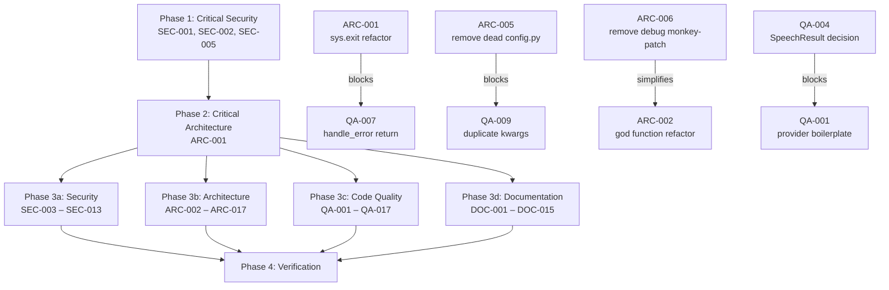

# Project Audit Report

> **Project**: PAR CLI TTS
> **Date**: 2026-04-25
> **Stack**: Python 3.13, Typer CLI, httpx, Pydantic, ONNX (Kokoro), ruff, pyright, uv
> **Audited by**: Claude Code Audit System

---

## Executive Summary

PAR CLI TTS is a well-structured multi-provider TTS CLI and library with a clean provider abstraction, solid type coverage, and thoughtful security measures (debug sanitization, SHA256 checksums). However, **SSL certificate verification is disabled by default** across all HTTP clients and model downloads, exposing API keys to man-in-the-middle attacks. The codebase also has a 992-line CLI module with a 420-line god function, dead code in multiple locations, and documentation that references the deprecated `par_cli_tts` package path. Remediation of the SSL issues and the library-killing `sys.exit()` calls should be completed before any other work.

### Issue Count by Severity

| Severity | Architecture | Security | Code Quality | Documentation | Total |
|----------|:-----------:|:--------:|:------------:|:-------------:|:-----:|
| 🔴 Critical | 1 | 2 | 0 | 2 | **5** |
| 🟠 High     | 4 | 3 | 5 | 4 | **16** |
| 🟡 Medium   | 7 | 4 | 7 | 5 | **23** |
| 🔵 Low      | 5 | 4 | 5 | 4 | **18** |
| **Total**   | **17** | **13** | **17** | **15** | **62** |

---

## 🔴 Critical Issues (Resolve Immediately)

### [SEC-001] SSL Verification Disabled in HTTP Client Factory
- **Area**: Security / Architecture / Code Quality
- **Location**: `par_tts/http_client.py:10-11`
- **Description**: `create_http_client()` defaults to `verify=False`, disabling SSL certificate verification for all HTTP requests made by every cloud provider (ElevenLabs, OpenAI, Deepgram, Gemini). API keys are transmitted in request headers on every call.
- **Impact**: Man-in-the-middle attackers can intercept API keys, inject arbitrary audio, or tamper with responses.
- **Remedy**: Change the default to `verify=True`. If users need to disable verification for specific environments, make it opt-in via an explicit flag or environment variable.

### [SEC-002] SSL Verification Disabled in Model Downloader
- **Area**: Security / Architecture
- **Location**: `par_tts/model_downloader.py:75-80`
- **Description**: The `_download_file` method explicitly disables SSL via `ssl.CERT_NONE` and `check_hostname = False`. The insecure opener is installed globally via `install_opener()`, affecting ALL subsequent `urllib` requests in the entire process.
- **Impact**: MITM attacks can serve malicious model files. The global opener installation weakens TLS security for the entire host process (critical for library usage).
- **Remedy**: Remove the custom SSL context entirely. Use default `urlretrieve` (which uses proper SSL verification). Remove `install_opener()`.

### [ARC-001] `sys.exit()` Called from Library Code
- **Area**: Architecture
- **Location**: `par_tts/errors.py:57`
- **Description**: `handle_error()` calls `sys.exit()` by default (`exit_on_error=True`). This function is used from `validate_api_key()`, `validate_file_path()`, and via the `@wrap_provider_error` decorator. Since `par_tts` is published as a library (with `get_provider()`, `list_providers()` as its public API), `sys.exit()` makes it impossible to use programmatically.
- **Impact**: Any application importing `par_tts` as a library cannot gracefully handle errors. A missing API key kills the entire host process.
- **Remedy**: Raise typed exceptions (`TTSError`) from library code. Reserve `sys.exit()` for the CLI layer only. The CLI's `main()` should catch `TTSError` and call `sys.exit()` with the appropriate code.

### [DOC-001] ARCHITECTURE.md Uses Stale `par_cli_tts` Paths Throughout
- **Area**: Documentation
- **Location**: `docs/ARCHITECTURE.md` (lines 138, 159, 171, 180, 189, 199, 210, 220, 235, 246, 257, 266, 275, 281, 288, 450, 1071, 1073)
- **Description**: Every file path reference in the architecture document uses the deprecated `par_cli_tts/` prefix. The canonical package was renamed to `par_tts` in v0.5.0. The provider template code block also uses wrong import paths.
- **Impact**: Developers following the architecture doc will create files in the wrong directory and use broken import paths.
- **Remedy**: Global find-and-replace `par_cli_tts` with `par_tts` in all file path references within ARCHITECTURE.md.

### [DOC-002] ARCHITECTURE.md Omits Deepgram and Gemini Providers from Diagrams
- **Area**: Documentation
- **Location**: `docs/ARCHITECTURE.md` (lines 24-121, 356-446, 466-540)
- **Description**: The high-level architecture diagram, class hierarchy diagram, and TTS request processing flow diagram show only three providers (ElevenLabs, OpenAI, Kokoro ONNX). Deepgram and Gemini are entirely absent.
- **Impact**: Developers cannot understand the full system. ~600 lines of provider code are invisible in the architecture doc.
- **Remedy**: Add DeepgramProvider and GeminiProvider to all Mermaid diagrams, the provider registration code snippet, and data flow diagrams.

---

## 🟠 High Priority Issues

### [ARC-002] God Function: `main()` is 420+ Lines with 25 Parameters
- **Area**: Architecture
- **Location**: `par_tts/cli/tts_cli.py:567-988`
- **Description**: The `main()` Typer command function accepts 25 parameters and spans ~420 lines. Helper functions (`handle_speech_generation`, `handle_dump_config`, `handle_voice_preview`) have 10-18 parameters each as pass-throughs. Violates Single Responsibility Principle.
- **Impact**: High cognitive load for maintenance. Adding a new provider requires touching the main function and multiple helpers. Testing requires mocking 25 parameters.
- **Remedy**: Decompose into a `TTSService` class that encapsulates resolved configuration state. Each operation (list, preview, generate, cache management) becomes a method on this class.

### [ARC-003] Dual Package Layout (`par_tts` + `par_cli_tts`) Creates Maintenance Burden
- **Area**: Architecture
- **Location**: `par_cli_tts/__init__.py`, `par_cli_tts/providers/__init__.py`
- **Description**: Two top-level packages ship in the wheel: `par_tts` (real) and `par_cli_tts` (deprecated compat shim re-exporting everything). Every import of the shim fires a `DeprecationWarning`. The shim's `py.typed` marker implies both are supported for type checking.
- **Impact**: Doubles the import surface. `pyrightconfig.json` and `.env.example` still reference the old name.
- **Remedy**: Set a clear removal timeline. Update `pyrightconfig.json` to include `par_tts/**/*.py`. Update `.env.example` to list all provider keys.

### [ARC-004] Provider-Specific Options Leaked into CLI Core via `if/elif` Chains
- **Area**: Architecture
- **Location**: `par_tts/cli/tts_cli.py:121-167`, `par_tts/cli/tts_cli.py:385-406`
- **Description**: `get_provider_kwargs()` and `handle_dump_config()` use hardcoded `if/elif` chains mapping provider names to kwargs. Adding a provider requires modifying these CLI functions, violating Open/Closed Principle. There are three independent implementations of the same mapping.
- **Impact**: Adding a provider requires changes in at least 4 places.
- **Remedy**: Move provider-specific option definitions into the provider classes. Each provider defines `get_default_options()` or an `options_class` attribute.

### [ARC-005] Dead Code: `par_tts/cli/config.py` Dataclasses Never Used
- **Area**: Architecture / Code Quality
- **Location**: `par_tts/cli/config.py` (entire file, 67 lines)
- **Description**: `AudioSettings`, `OutputSettings`, `ProviderSettings`, and `TTSConfig` dataclasses are only used by `tests/test_config.py`. The actual CLI uses `ConfigFile` from `config_file.py`. `TTSConfig.get_provider_kwargs()` duplicates logic in `tts_cli.py`.
- **Impact**: Two parallel config systems that can drift out of sync. Tests verify the unused path while the real path goes untested.
- **Remedy**: Remove `par_tts/cli/config.py` entirely. Update tests to cover `ConfigFile` and the actual CLI config flow.

### [SEC-003] API Keys Stored in Plaintext in Config File
- **Area**: Security
- **Location**: `par_tts/cli/config_file.py:32-35`
- **Description**: `config.yaml` stores API keys as plaintext strings with default file permissions. Any local user can read the file.
- **Impact**: Malware scanning the filesystem finds these keys. Multi-user systems expose keys to other users.
- **Remedy**: Store API keys exclusively in environment variables or use OS keychain. At minimum, set `chmod 0600` on config file creation.

### [SEC-004] PowerShell Command Injection in Audio Playback
- **Area**: Security
- **Location**: `par_tts/audio.py:96-97`
- **Description**: `_play_with_powershell()` interpolates `file_path` directly into a PowerShell script via f-strings. PowerShell metacharacters in the path enable command injection.
- **Impact**: Crafted output file paths could execute arbitrary PowerShell commands.
- **Remedy**: Pass the path as a subprocess parameter instead of string interpolation, or properly escape for PowerShell.

### [SEC-005] Global Opener Installation in Model Downloader
- **Area**: Security
- **Location**: `par_tts/model_downloader.py:79-80`
- **Description**: `urllib.request.install_opener(opener)` installs a global opener with disabled SSL. This affects ALL subsequent `urllib` calls in the entire process.
- **Impact**: If used as a library dependency, silently weakens the host application's TLS security.
- **Remedy**: Use the opener directly for the download instead of installing it globally.

### [QA-001] Duplicated Boilerplate Across All Five Providers
- **Area**: Code Quality
- **Location**: `par_tts/providers/elevenlabs.py`, `openai.py`, `deepgram.py`, `gemini.py`, `kokoro_onnx.py`
- **Description**: `play_audio()` and `save_audio()` implementations are copy-pasted across all five providers. Iterator-to-bytes conversion (`b"".join(audio_data)`) appears in all five.
- **Impact**: Bug fixes must be applied in five places. The base class already has `stream_to_file()` but lacks default `play_audio()` and `save_audio()`.
- **Remedy**: Move common implementations into `TTSProvider` base class.

### [QA-002] Dead Code: `wrap_provider_error` Decorator Never Used
- **Area**: Code Quality
- **Location**: `par_tts/errors.py:87-100`
- **Description**: The decorator is defined but never applied to any function in the codebase.
- **Remedy**: Apply it to provider methods or remove it.

### [QA-003] Dead Code: `write_with_stream()` Never Called
- **Area**: Code Quality
- **Location**: `par_tts/utils.py:22-30`
- **Description**: The function is defined but never imported or called anywhere.
- **Remedy**: Remove it or document future intent.

### [QA-004] `SpeechResult` Dataclass Exported but Never Used
- **Area**: Code Quality
- **Location**: `par_tts/providers/base.py:142-149`
- **Description**: Exported via `__all__` and re-exported from `__init__.py`, but never instantiated by any provider. All providers return `bytes` or `Iterator[bytes]` directly.
- **Remedy**: Integrate it into the provider interface or remove it from the public API.

### [QA-005] Bare `dict` Return Type in Model Downloader
- **Area**: Code Quality
- **Location**: `par_tts/model_downloader.py:179`
- **Description**: `get_model_info()` returns untyped `dict` without type parameters.
- **Remedy**: Add `def get_model_info(self) -> dict[str, Any]:`.

### [DOC-003] CLAUDE.md Uses Stale `par_cli_tts` Paths
- **Area**: Documentation
- **Location**: `CLAUDE.md` (lines 72, 81-86, 89, 93, 98, 106, 119, 169, 246)
- **Description**: Every file path reference uses the old `par_cli_tts/` prefix. Version reference says `par_cli_tts/__init__.py` when it is now in `par_tts/__init__.py`.
- **Impact**: AI assistants using CLAUDE.md will reference wrong file paths.
- **Remedy**: Update all path references from `par_cli_tts/` to `par_tts/`.

### [DOC-004] No CONTRIBUTING.md File
- **Area**: Documentation
- **Location**: Missing (root of repository)
- **Description**: The README has a brief Contributing section but no dedicated guide for code style, PR process, branch naming, or development workflow.
- **Remedy**: Create `CONTRIBUTING.md` with development setup, coding conventions, commit format, PR process, and testing requirements.

### [DOC-005] CHANGELOG `[Unreleased]` Should Be `[0.5.0]`
- **Area**: Documentation
- **Location**: `CHANGELOG.md`
- **Description**: The CHANGELOG has a large `[Unreleased]` section containing all v0.5.0 changes (library API, Deepgram, Gemini, import rename). These were already released.
- **Impact**: Users cannot determine what is unreleased vs. shipped.
- **Remedy**: Rename `[Unreleased]` to `[0.5.0] - 2025-04-25`. Add a new empty `[Unreleased]` section.

### [DOC-006] README `make update-cache` vs `make refresh-cache` Inconsistency
- **Area**: Documentation
- **Location**: `README.md` (lines 942 vs 728)
- **Description**: The Development Commands section says `make update-cache` while the Cache Management section says `make refresh-cache`. Both target the same Makefile alias.
- **Remedy**: Standardize on one name across both sections.

---

## 🟡 Medium Priority Issues

### Architecture

### [ARC-006] `sys._debug_mode` Monkey-Patching
- **Location**: `par_tts/cli/tts_cli.py:563,825`, `par_tts/errors.py:53`
- **Description**: Debug state is communicated by monkey-patching `sys._debug_mode`. Not thread-safe, confuses type checkers (`# type: ignore`), and fails silently in library mode.
- **Remedy**: Pass debug state through parameters or use `contextvars.ContextVar`.

### [ARC-007] `voice_cache.py` Leaks ElevenLabs SDK into Import Graph
- **Location**: `par_tts/voice_cache.py:18`
- **Description**: Top-level `from elevenlabs.client import ElevenLabs` forces offline-only users to have the SDK installed.
- **Remedy**: Move the import inside methods that need it.

### [ARC-008] Provider Method Signatures Inconsistent with Base Class
- **Location**: Multiple provider files
- **Description**: `KokoroONNXProvider.save_audio` takes `(bytes, str, format=None)` instead of `(bytes|Iterator[bytes], str|Path)`. `OpenAIProvider.save_audio` only accepts `bytes`. `KokoroONNXProvider.__init__` does not accept `api_key`.
- **Remedy**: Standardize all signatures to match the abstract base class.

### [ARC-009] `GeminiOptions` Dataclass is Empty
- **Location**: `par_tts/providers/base.py:186-187`
- **Description**: `@dataclass class GeminiOptions: pass` is exported as public API but has no fields.
- **Remedy**: Add meaningful fields or remove from public API.

### [ARC-010] Kokoro ONNX Uses Temp File Round-Trip
- **Location**: `par_tts/providers/kokoro_onnx.py:150-166`
- **Description**: `generate_speech` writes to a temp file then reads it back. An in-memory `BytesIO` buffer would be simpler and faster.
- **Remedy**: Replace with `io.BytesIO`.

### [ARC-011] CI Only Triggers Manually
- **Location**: `.github/workflows/publish.yml:3`
- **Description**: `on: workflow_dispatch` only — no push/PR triggers. No automated quality gate for PRs.
- **Remedy**: Add `on: push` and `on: pull_request` for build/test steps.

### [ARC-012] Hardcoded `.mp3` Format Suffix for All Providers
- **Location**: `par_tts/cli/tts_cli.py:510,543`
- **Description**: Temp files always get `.mp3` extension, but Kokoro outputs WAV and Gemini outputs WAV.
- **Remedy**: Derive extension from the active provider's `supported_formats[0]`.

### Security

### [SEC-006] No Path Traversal Validation for `@-file` Input
- **Location**: `par_tts/cli/tts_cli.py:224-234`
- **Description**: `@filename` input reads file contents without restricting to safe directories. `@/etc/shadow` would read and transmit sensitive files to TTS APIs.
- **Remedy**: Restrict file reading to safe directories or validate resolved paths.

### [SEC-007] Predictable Temp File Names
- **Location**: `par_tts/cli/tts_cli.py:509-516`
- **Description**: Temp files use `tts_YYYYMMDD_HHMMSS.mp3` naming, enabling TOCTOU symlink attacks.
- **Remedy**: Use `tempfile.mkstemp()` or `NamedTemporaryFile`.

### [SEC-008] Missing Temp File Permissions
- **Location**: `par_tts/model_downloader.py:73`
- **Description**: Download temp files created without explicit permissions. On multi-user systems, other users can read them.
- **Remedy**: Set `os.chmod(temp_path, 0o600)` after creation.

### [SEC-009] API Key Logged in Gemini Provider on Error
- **Location**: `par_tts/providers/gemini.py:169`
- **Description**: Error messages from Gemini may contain the API key in `resp.text[:500]`.
- **Remedy**: Sanitize error messages that may contain API keys.

### Code Quality

### [QA-006] 31 Ruff Lint Errors in Test Files
- **Location**: `tests/conftest.py`, `test_api_surface.py`, `test_voice_cache.py`, `test_providers/test_provider_options.py`
- **Description**: Unused imports and unsorted import blocks across test files.
- **Remedy**: Run `ruff check --fix tests/`.

### [QA-007] `handle_error()` Return Type `NoReturn | None`
- **Location**: `par_tts/errors.py:45-59`
- **Description**: Dual behavior (exit vs return) forces callers to add unreachable `return None` statements.
- **Remedy**: Split into `exit_with_error()` (always exits) and `log_error()` (always returns).

### [QA-008] Test Assertions Use `Exception` Instead of `ValidationError`
- **Location**: `tests/test_config.py:147-159`
- **Description**: Four tests catch `Exception` when testing Pydantic validation, making them pass even if the wrong exception type is raised.
- **Remedy**: Change to `pytest.raises(ValidationError)`.

### [QA-009] Duplicate `get_provider_kwargs()` Logic
- **Location**: `par_tts/cli/tts_cli.py:121-167` and `par_tts/cli/config.py:50-66`
- **Description**: Two independent implementations of the same provider kwargs mapping. The `config.py` version is already outdated (missing `instructions`, Deepgram, Gemini).
- **Remedy**: Remove the unused `config.py` version entirely.

### [QA-010] Hardcoded User Name "Paul" in Claude Style Installer
- **Location**: `par_tts/cli/install_claude_style.py:129-130`
- **Description**: Regex replacements include `r"Paul,"` as a literal pattern — a developer-specific artifact.
- **Remedy**: Ensure the template uses only generic placeholders.

### [QA-011] `import base64` Inside Function Bodies
- **Location**: `par_tts/voice_cache.py:296,321`
- **Description**: `base64` import inside method bodies instead of module level. Violates PEP 8.
- **Remedy**: Move to top-level imports.

### [QA-012] Config Override Compares Against Magic Values
- **Location**: `par_tts/cli/tts_cli.py:804-811`
- **Description**: Config overrides CLI defaults by checking if the value equals the Typer default. Users explicitly passing `--speed 1.0` get overridden by config.
- **Remedy**: Use `None` as the Typer default with a sentinel pattern.

### Documentation

### [DOC-007] Missing Public Function Docstrings in errors.py
- **Location**: `par_tts/errors.py` (lines 45, 62, 73, 87)
- **Description**: Four public functions (`handle_error`, `validate_api_key`, `validate_file_path`, `wrap_provider_error`) lack docstrings.
- **Remedy**: Add Google-style docstrings.

### [DOC-008] Missing Docstrings in Deepgram and Gemini Providers
- **Location**: `par_tts/providers/deepgram.py`, `par_tts/providers/gemini.py`
- **Description**: 7 undocumented methods in Deepgram, 8 in Gemini (including `list_voices`, `save_audio`, `play_audio`).
- **Remedy**: Add docstrings matching the style used in other providers.

### [DOC-009] Style Guide References Wrong Project
- **Location**: `docs/DOCUMENTATION_STYLE_GUIDE.md`
- **Description**: Header says "Par Terminal Emulator project" and prescribes an irrelevant directory structure.
- **Remedy**: Update to reference "PAR CLI TTS". Adjust file organization section.

### [DOC-010] Outdated Roadmap in ARCHITECTURE.md
- **Location**: `docs/ARCHITECTURE.md:1412-1476`
- **Description**: Gantt chart shows 2024 dates. "Recent Improvements" stops at v0.4.0, missing v0.4.2 and v0.5.0.
- **Remedy**: Update roadmap to reflect current status.

### [DOC-011] No SECURITY.md File
- **Location**: Missing (root of repository)
- **Description**: Project handles API keys and has security-related code but no vulnerability reporting policy.
- **Remedy**: Create `SECURITY.md` with reporting instructions and security practices summary.

---

## 🔵 Low Priority / Improvements

### Architecture
- **[ARC-013]** `handle_error` return type is `NoReturn | None` — split into two functions for explicit control flow
- **[ARC-014]** `base64` import inside function bodies in `voice_cache.py` — move to top-level
- **[ARC-015]** `install_claude_style.py` uses regex for template substitution — use proper template variables
- **[ARC-016]** `ruff.toml` targets py313 but `pyproject.toml` declares 3.11 minimum — align versions
- **[ARC-017]** Missing `.gitignore` entry for `.claude/` artifacts

### Security
- **[SEC-010]** Env var collection in debug mode gathers sensitive names — restrict to known variables
- **[SEC-011]** No integrity check for cached voice data — add checksum/HMAC
- **[SEC-012]** Dependency pinning could be tighter in `pyproject.toml` — consider upper bounds
- **[SEC-013]** `@filename` path not canonicalized before validation — use resolved path for both validate and open

### Code Quality
- **[QA-013]** `TTSProvider.__init__` stores unused `self.config` — remove or document
- **[QA-014]** `config.py` missing Deepgram/Gemini options — moot if dead code is removed
- **[QA-015]** VLC path detection misses winget/custom installs — add `shutil.which("vlc")`
- **[QA-016]** Inconsistent `from __future__ import annotations` usage across files
- **[QA-017]** `test_logging_decouple.py` uses fragile text-based import checking — consider AST analysis

### Documentation
- **[DOC-012]** README "What's New" section duplicates CHANGELOG content — condense to latest release + link
- **[DOC-013]** README version badge hardcodes 0.5.0 — use dynamic PyPI badge
- **[DOC-014]** Architecture doc missing cross-references to CHANGELOG — add link
- **[DOC-015]** `Voice` and `SpeechResult` dataclasses lack field-level docs — add Attributes section

---

## Detailed Findings

### Architecture & Design
The provider abstraction pattern (`TTSProvider` ABC with `PROVIDERS` registry) is well-structured. The primary architectural concerns are: (1) SSL verification disabled by default undermines the entire security model, (2) `sys.exit()` in library code prevents programmatic use, (3) the 992-line CLI module with a 420-line god function is the biggest maintainability bottleneck. The dual package layout adds unnecessary complexity. Provider-specific option handling leaks into CLI core through `if/elif` chains, requiring 4-place edits when adding providers. The dead `cli/config.py` module duplicates logic from the active config system. Positive: clean library/CLI separation (enforced by `test_logging_decouple.py`), comprehensive Pydantic config layer with XDG-compliant paths, and SHA256 model verification.

### Security Assessment
The highest-risk finding is SSL verification disabled across the entire application — for model downloads, for all API provider HTTP clients, and globally installed as an opener. This exposes API keys in transit to interception and undermines the otherwise reasonable security architecture. The PowerShell command injection in audio playback is also serious for Windows users. Positive: `yaml.safe_load()` used consistently, debug output sanitization masks API keys, Pydantic `extra = "forbid"` prevents config injection, atomic model downloads with SHA256 verification, `.env` excluded from git, Sigstore signing in CI, subprocess calls use list arguments (no `shell=True`).

### Code Quality
Zero pyright errors demonstrate thorough type annotation. The main quality concerns are duplicated provider boilerplate (5 copies of `play_audio`/`save_audio`), dead code in multiple locations (`wrap_provider_error`, `write_with_stream`, `cli/config.py`, `SpeechResult`), and 31 lint errors in test files. Test coverage is estimated at ~36% overall, with 0% coverage for the CLI entry point and all provider implementations. The `sys._debug_mode` monkey-patching is fragile and not thread-safe. Positive: clean public API with explicit `__all__` exports, centralized defaults in `defaults.py`, thorough type annotations.

### Documentation Review
The README is comprehensive and well-structured (installation, library usage, CLI examples, all five providers, configuration, troubleshooting). The primary documentation gap is ARCHITECTURE.md being actively misleading — every file path uses the deprecated `par_cli_tts` prefix and Deepgram/Gemini are entirely missing from diagrams. CLAUDE.md has the same stale path issue. The CHANGELOG's `[Unreleased]` section should be versioned as `[0.5.0]`. Positive: excellent module-level docstring coverage (22/22 modules), comprehensive CLAUDE.md for AI-assisted development, type hints serve as machine-checked documentation.

---

## Remediation Roadmap

### Immediate Actions (Before Next Deployment)
1. Enable SSL verification by default in `http_client.py` and `model_downloader.py` (SEC-001, SEC-002)
2. Remove `install_opener()` global side effect (SEC-005)
3. Remove `sys.exit()` from library code — raise `TTSError` instead (ARC-001)

### Short-term (Next 1-2 Sprints)
1. Remove dead code: `cli/config.py`, `wrap_provider_error`, `write_with_stream`, `SpeechResult` (ARC-005, QA-002-004)
2. Extract common provider boilerplate into base class (QA-001)
3. Fix PowerShell command injection (SEC-004)
4. Set restrictive permissions on config file (SEC-003)
5. Update all documentation paths from `par_cli_tts` to `par_tts` (DOC-001, DOC-003)
6. Update ARCHITECTURE.md diagrams with all five providers (DOC-002)
7. Fix CHANGELOG versioning (DOC-005)

### Long-term (Backlog)
1. Decompose `tts_cli.py` god function into service class (ARC-002)
2. Move provider options into provider classes (ARC-004)
3. Remove `par_cli_tts` compat shim (ARC-003)
4. Add CI triggers for push/PR (ARC-011)
5. Add SECURITY.md and CONTRIBUTING.md (DOC-004, DOC-011)
6. Improve test coverage (currently ~36%)

---

## Positive Highlights

1. **Clean provider abstraction** — `TTSProvider` ABC with `PROVIDERS` registry makes adding providers conceptually straightforward
2. **Zero pyright errors** — thorough type annotations across the entire codebase
3. **Comprehensive configuration layer** — Pydantic `ConfigFile` with per-provider voice mappings, XDG-compliant paths, field validators that reject unknown providers
4. **Security consciousness** — debug sanitization, SHA256 model verification, atomic downloads, `.env` excluded from git
5. **Solid test infrastructure** — tests cover public API, config validation, voice cache, and enforce architectural constraints (no CLI imports in library)
6. **Excellent README** — covers installation, library usage with code examples, 30+ CLI examples, all five providers, full configuration reference
7. **Good library/CLI separation** — public API (`get_provider`, `list_providers`) is independent of Typer CLI
8. **Sigstore CI signing** — distribution artifacts signed with Sigstore for supply chain integrity

---

## Audit Confidence

| Area | Files Reviewed | Confidence |
|------|---------------|-----------|
| Architecture | 18 | High |
| Security | 15 | High |
| Code Quality | 22 | High |
| Documentation | 10 | High |

---

## Remediation Plan

> This section is generated by the audit and consumed directly by `/fix-audit`.
> It pre-computes phase assignments and file conflicts so the fix orchestrator
> can proceed without re-analyzing the codebase.

### Phase Assignments

#### Phase 1 — Critical Security (Sequential, Blocking)
<!-- Issues that must be fixed before anything else. -->
| ID | Title | File(s) | Severity |
|----|-------|---------|----------|
| SEC-001 | SSL disabled in HTTP client factory | `par_tts/http_client.py` | Critical |
| SEC-002 | SSL disabled in model downloader | `par_tts/model_downloader.py` | Critical |
| SEC-005 | Global opener installation | `par_tts/model_downloader.py` | High |

#### Phase 2 — Critical Architecture (Sequential, Blocking)
<!-- Issues that restructure the codebase; must complete before Code Quality fixes. -->
| ID | Title | File(s) | Severity | Blocks |
|----|-------|---------|----------|--------|
| ARC-001 | sys.exit() in library code | `par_tts/errors.py` | Critical | QA-007, DOC-007 |

#### Phase 3 — Parallel Execution
<!-- All remaining work, safe to run concurrently by domain. -->

**3a — Security (remaining)**
| ID | Title | File(s) | Severity |
|----|-------|---------|----------|
| SEC-003 | Plaintext API keys in config | `par_tts/cli/config_file.py` | High |
| SEC-004 | PowerShell command injection | `par_tts/audio.py` | High |
| SEC-006 | Path traversal in @-file input | `par_tts/cli/tts_cli.py` | Medium |
| SEC-007 | Predictable temp file names | `par_tts/cli/tts_cli.py` | Medium |
| SEC-008 | Missing temp file permissions | `par_tts/model_downloader.py` | Medium |
| SEC-009 | API key in Gemini error messages | `par_tts/providers/gemini.py` | Medium |
| SEC-010 | Env var collection in debug | `par_tts/cli/tts_cli.py` | Low |
| SEC-011 | No cache integrity check | `par_tts/voice_cache.py` | Low |
| SEC-012 | Dependency pinning | `pyproject.toml` | Low |
| SEC-013 | Uncanonicalized path | `par_tts/cli/tts_cli.py` | Low |

**3b — Architecture (remaining)**
| ID | Title | File(s) | Severity |
|----|-------|---------|----------|
| ARC-002 | God function decomposition | `par_tts/cli/tts_cli.py` | High |
| ARC-003 | Dual package layout | `par_cli_tts/` | High |
| ARC-004 | Provider options in CLI core | `par_tts/cli/tts_cli.py` | High |
| ARC-005 | Dead config.py | `par_tts/cli/config.py` | High |
| ARC-006 | sys._debug_mode monkey-patch | `par_tts/cli/tts_cli.py`, `par_tts/errors.py` | Medium |
| ARC-007 | voice_cache leaks ElevenLabs import | `par_tts/voice_cache.py` | Medium |
| ARC-008 | Provider signatures inconsistent | Multiple providers | Medium |
| ARC-009 | Empty GeminiOptions | `par_tts/providers/base.py` | Medium |
| ARC-010 | Kokoro temp file round-trip | `par_tts/providers/kokoro_onnx.py` | Medium |
| ARC-011 | CI only manual triggers | `.github/workflows/publish.yml` | Medium |
| ARC-012 | Hardcoded audio format suffixes | `par_tts/cli/tts_cli.py` | Medium |
| ARC-013 | handle_error return type | `par_tts/errors.py` | Low |
| ARC-014 | base64 import inside function | `par_tts/voice_cache.py` | Low |
| ARC-015 | install_claude_style regex | `par_tts/cli/install_claude_style.py` | Low |
| ARC-016 | ruff.toml vs pyproject.toml version | `ruff.toml`, `pyproject.toml` | Low |
| ARC-017 | Missing .gitignore for .claude/ | `.gitignore` | Low |

**3c — Code Quality (all)**
| ID | Title | File(s) | Severity |
|----|-------|---------|----------|
| QA-001 | Duplicated provider boilerplate | All provider files | High |
| QA-002 | Dead wrap_provider_error decorator | `par_tts/errors.py` | High |
| QA-003 | Dead write_with_stream function | `par_tts/utils.py` | High |
| QA-004 | Unused SpeechResult dataclass | `par_tts/providers/base.py` | High |
| QA-005 | Bare dict return type | `par_tts/model_downloader.py` | High |
| QA-006 | 31 ruff lint errors in tests | `tests/` | Medium |
| QA-007 | handle_error NoReturn \| None | `par_tts/errors.py` | Medium |
| QA-008 | Test Exception not ValidationError | `tests/test_config.py` | Medium |
| QA-009 | Duplicate get_provider_kwargs | `par_tts/cli/tts_cli.py`, `par_tts/cli/config.py` | Medium |
| QA-010 | Hardcoded "Paul" in installer | `par_tts/cli/install_claude_style.py` | Medium |
| QA-011 | Inline base64 imports | `par_tts/voice_cache.py` | Medium |
| QA-012 | Config override magic values | `par_tts/cli/tts_cli.py` | Medium |
| QA-013 | Unused self.config in base | `par_tts/providers/base.py` | Low |
| QA-014 | Missing Deepgram/Gemini in config.py | `par_tts/cli/config.py` | Low |
| QA-015 | VLC path detection | `par_tts/audio.py` | Low |
| QA-016 | Inconsistent future annotations | Multiple | Low |
| QA-017 | Fragile text check in test | `tests/test_logging_decouple.py` | Low |

**3d — Documentation (all)**
| ID | Title | File(s) | Severity |
|----|-------|---------|----------|
| DOC-001 | ARCHITECTURE.md stale paths | `docs/ARCHITECTURE.md` | Critical |
| DOC-002 | ARCHITECTURE.md missing providers | `docs/ARCHITECTURE.md` | Critical |
| DOC-003 | CLAUDE.md stale paths | `CLAUDE.md` | High |
| DOC-004 | No CONTRIBUTING.md | (missing) | High |
| DOC-005 | CHANGELOG Unreleased | `CHANGELOG.md` | High |
| DOC-006 | README make command inconsistency | `README.md` | High |
| DOC-007 | Missing docstrings in errors.py | `par_tts/errors.py` | Medium |
| DOC-008 | Missing docstrings in deepgram/gemini | `par_tts/providers/deepgram.py`, `gemini.py` | Medium |
| DOC-009 | Style guide wrong project name | `docs/DOCUMENTATION_STYLE_GUIDE.md` | Medium |
| DOC-010 | Outdated roadmap | `docs/ARCHITECTURE.md` | Medium |
| DOC-011 | No SECURITY.md | (missing) | Medium |
| DOC-012 | README duplicates CHANGELOG | `README.md` | Low |
| DOC-013 | Badge hardcodes version | `README.md` | Low |
| DOC-014 | Missing cross-references | `docs/ARCHITECTURE.md` | Low |
| DOC-015 | Voice/SpeechResult field docs | `par_tts/providers/base.py` | Low |

### File Conflict Map
<!-- Files touched by issues in multiple domains. Fix agents must read current file state
     before editing — a prior agent may have already changed these. -->

| File | Domains | Issues | Risk |
|------|---------|--------|------|
| `par_tts/http_client.py` | Security + Architecture + Code Quality | SEC-001, ARC-001, QA-001 | ⚠️ Read before edit |
| `par_tts/model_downloader.py` | Security + Architecture + Code Quality | SEC-002, SEC-005, SEC-008, QA-005 | ⚠️ Read before edit |
| `par_tts/errors.py` | Architecture + Code Quality + Documentation | ARC-001, QA-002, QA-007, DOC-007 | ⚠️ Read before edit |
| `par_tts/cli/tts_cli.py` | Architecture + Code Quality + Security | ARC-002, ARC-004, ARC-006, ARC-012, QA-009, QA-012, SEC-006, SEC-007, SEC-010, SEC-013 | ⚠️ Read before edit |
| `par_tts/voice_cache.py` | Architecture + Code Quality + Security | ARC-007, ARC-014, QA-011, SEC-011 | ⚠️ Read before edit |
| `par_tts/providers/base.py` | Architecture + Code Quality + Documentation | ARC-009, QA-004, QA-013, DOC-015 | ⚠️ Read before edit |
| `par_tts/providers/gemini.py` | Code Quality + Documentation + Security | QA-001, DOC-008, SEC-009 | ⚠️ Read before edit |
| `par_tts/providers/deepgram.py` | Code Quality + Documentation | QA-001, DOC-008 | ⚠️ Read before edit |
| `par_tts/cli/config_file.py` | Security | SEC-003 | Safe |
| `par_tts/audio.py` | Security + Code Quality | SEC-004, QA-015 | ⚠️ Read before edit |
| `par_tts/cli/install_claude_style.py` | Code Quality | QA-010 | Safe |
| `docs/ARCHITECTURE.md` | Documentation | DOC-001, DOC-002, DOC-010, DOC-014 | Safe |
| `CLAUDE.md` | Documentation | DOC-003 | Safe |
| `CHANGELOG.md` | Documentation | DOC-005 | Safe |
| `README.md` | Documentation | DOC-006, DOC-012, DOC-013 | Safe |

### Blocking Relationships
<!-- Explicit dependency declarations from audit agents.
     Format: [blocker issue] → [blocked issue] — reason -->
- ARC-001 → QA-007: ARC-001 refactors `errors.py` error handling; QA-007 also modifies `handle_error()` return type
- ARC-005 → QA-009: ARC-005 removes `par_tts/cli/config.py`; QA-009's duplicate `get_provider_kwargs` in config.py becomes moot
- ARC-006 → ARC-002: ARC-006 removes `sys._debug_mode` monkey-patching; ARC-002's god-function refactor will be simpler without it
- QA-004 → QA-001: QA-004 decides `SpeechResult` fate; QA-001's base-class default methods may need `SpeechResult` integration
- SEC-001 → All provider fixes: SEC-001 fixes `http_client.py`; all provider code depends on the HTTP client factory
- SEC-002 → SEC-005: SEC-002 fixes model downloader SSL; SEC-005 removes the global opener from the same file

### Dependency Diagram

