# PAR CLI TTS Architecture Documentation

This document provides a comprehensive overview of the PAR CLI TTS system architecture, including component design, data flow, provider abstraction patterns, and extension points for adding new TTS providers.

## Table of Contents

1. [System Overview](#system-overview)
2. [Component Architecture](#component-architecture)
3. [Provider Abstraction Pattern](#provider-abstraction-pattern)
4. [Data Flow](#data-flow)
5. [Voice Caching System](#voice-caching-system)
6. [Model Management System](#model-management-system)
7. [Configuration Management](#configuration-management)
8. [Build and Deployment Architecture](#build-and-deployment-architecture)
9. [Extension Points](#extension-points)
10. [Error Handling and Recovery](#error-handling-and-recovery)
11. [Performance Considerations](#performance-considerations)
12. [Security Considerations](#security-considerations)
13. [Future Enhancements](#future-enhancements)
14. [Conclusion](#conclusion)
15. [Related Documentation](#related-documentation)

## System Overview

PAR CLI TTS is a command-line text-to-speech tool that provides a unified interface for multiple TTS providers including cloud-based (ElevenLabs, OpenAI, Deepgram, Google Gemini) and offline (Kokoro ONNX) solutions. The architecture follows a provider abstraction pattern backed by a plugin registry, enabling built-in and third-party TTS services to share the same discovery, metadata, and initialization path while maintaining a consistent user experience.

### High-Level Architecture

```mermaid
graph TB
    subgraph "User Interface Layer"
        CLI[CLI Interface<br/>par_tts/cli/tts_cli.py]
        KCLI[Kokoro CLI<br/>par_tts/cli/kokoro_cli.py]
        ENV[Environment Variables<br/>.env]
        CONF[Config File<br/>~/.config/par-tts/config.yaml]
    end

    subgraph "Core Application Layer"
        PF[Provider Factory<br/>provider_factory.py]
        PR[Provider Registry<br/>providers/registry.py]
        PIPE[Speech Pipeline<br/>pipeline.py]
        TEXT[Text Processing<br/>text_processing.py]
        APROC[Audio Processing<br/>audio_processing.py]
        WF[Workflow Automation<br/>workflow.py]
        VC[Voice Cache<br/>voice_cache.py]
        MD[Model Downloader<br/>model_downloader.py]
        CFG[Configuration Manager<br/>par_tts/cli/config_file.py]
        DIAG[Diagnostics<br/>diagnostics.py]
        ERR[Error Handler<br/>errors.py]
        LOG[Logging Config<br/>logging_config.py]
        RETRY[Retry Policy<br/>retry.py]
        COST[Cost Estimates<br/>costs.py]
        UTIL[Utilities<br/>utils.py]
        APB[Audio Playback<br/>audio.py]
        CONS[Console<br/>par_tts/cli/console.py]
        HTTP[HTTP Client<br/>http_client.py]
        DFLT[Defaults<br/>defaults.py]
    end

    subgraph "Provider Abstraction Layer"
        BASE[TTSProvider<br/>Abstract Base Class]
        EL[ElevenLabsProvider]
        OA[OpenAIProvider]
        KO[KokoroONNXProvider]
        DG[DeepgramProvider]
        GM[GeminiProvider]
        FP[External Provider Plugins<br/>entry points]
    end

    subgraph "External Services"
        ELAPI[ElevenLabs API]
        OAAPI[OpenAI API]
        ONNX[ONNX Runtime<br/>Local]
        DGAPI[Deepgram API]
        GMAPI[Gemini API]
        FAPI[Future APIs<br/>...]
    end

    subgraph "Storage Layer"
        CACHE[(Voice Cache<br/>YAML)]
        MODELS[(Model Files<br/>ONNX/BIN)]
        AFILE[Audio Files<br/>MP3/WAV/etc]
    end

    CLI --> PF
    CLI --> PR
    CLI --> CFG
    CLI --> ERR
    CLI --> CONS
    CLI --> PIPE
    CLI --> WF
    CLI --> DIAG
    CLI --> LOG
    CLI --> COST
    KCLI --> MD
    KCLI --> CONS
    ENV --> CFG
    CONF --> CFG
    PF --> PR
    PR --> BASE
    PIPE --> BASE
    PIPE --> TEXT
    PIPE --> APROC
    WF --> TEXT
    WF --> APROC
    PF --> UTIL
    PF --> DFLT
    BASE --> APB
    BASE --> RETRY
    BASE --> EL
    BASE --> OA
    BASE --> KO
    BASE --> DG
    BASE --> GM
    BASE --> FP
    EL --> VC
    EL --> ELAPI
    EL --> HTTP
    OA --> OAAPI
    OA --> HTTP
    KO --> MD
    KO --> ONNX
    DG --> DGAPI
    DG --> HTTP
    GM --> GMAPI
    GM --> HTTP
    FP --> FAPI
    VC --> CACHE
    MD --> MODELS
    EL --> AFILE
    OA --> AFILE
    KO --> AFILE
    DG --> AFILE
    GM --> AFILE
    ERR --> CONS

    style CLI fill:#4a148c,stroke:#9c27b0,stroke-width:2px,color:#ffffff
    style KCLI fill:#4a148c,stroke:#9c27b0,stroke-width:2px,color:#ffffff
    style ENV fill:#37474f,stroke:#78909c,stroke-width:2px,color:#ffffff
    style PF fill:#e65100,stroke:#ff9800,stroke-width:3px,color:#ffffff
    style PR fill:#e65100,stroke:#ff9800,stroke-width:3px,color:#ffffff
    style PIPE fill:#e65100,stroke:#ff9800,stroke-width:3px,color:#ffffff
    style TEXT fill:#0d47a1,stroke:#2196f3,stroke-width:2px,color:#ffffff
    style APROC fill:#0d47a1,stroke:#2196f3,stroke-width:2px,color:#ffffff
    style WF fill:#4a148c,stroke:#9c27b0,stroke-width:2px,color:#ffffff
    style VC fill:#0d47a1,stroke:#2196f3,stroke-width:2px,color:#ffffff
    style MD fill:#0d47a1,stroke:#2196f3,stroke-width:2px,color:#ffffff
    style CONF fill:#37474f,stroke:#78909c,stroke-width:2px,color:#ffffff
    style CFG fill:#e65100,stroke:#ff9800,stroke-width:3px,color:#ffffff
    style DIAG fill:#0d47a1,stroke:#2196f3,stroke-width:2px,color:#ffffff
    style ERR fill:#b71c1c,stroke:#f44336,stroke-width:2px,color:#ffffff
    style LOG fill:#37474f,stroke:#78909c,stroke-width:2px,color:#ffffff
    style RETRY fill:#ff6f00,stroke:#ffa726,stroke-width:2px,color:#ffffff
    style COST fill:#0d47a1,stroke:#2196f3,stroke-width:2px,color:#ffffff
    style UTIL fill:#0d47a1,stroke:#2196f3,stroke-width:2px,color:#ffffff
    style CONS fill:#37474f,stroke:#78909c,stroke-width:2px,color:#ffffff
    style APB fill:#37474f,stroke:#78909c,stroke-width:2px,color:#ffffff
    style HTTP fill:#37474f,stroke:#78909c,stroke-width:2px,color:#ffffff
    style DFLT fill:#37474f,stroke:#78909c,stroke-width:2px,color:#ffffff
    style BASE fill:#37474f,stroke:#78909c,stroke-width:2px,color:#ffffff
    style EL fill:#1b5e20,stroke:#4caf50,stroke-width:2px,color:#ffffff
    style OA fill:#1b5e20,stroke:#4caf50,stroke-width:2px,color:#ffffff
    style KO fill:#1b5e20,stroke:#4caf50,stroke-width:2px,color:#ffffff
    style DG fill:#1b5e20,stroke:#4caf50,stroke-width:2px,color:#ffffff
    style GM fill:#1b5e20,stroke:#4caf50,stroke-width:2px,color:#ffffff
    style FP fill:#37474f,stroke:#78909c,stroke-width:2px,color:#ffffff
    style ELAPI fill:#880e4f,stroke:#c2185b,stroke-width:2px,color:#ffffff
    style OAAPI fill:#880e4f,stroke:#c2185b,stroke-width:2px,color:#ffffff
    style ONNX fill:#0d47a1,stroke:#2196f3,stroke-width:2px,color:#ffffff
    style DGAPI fill:#880e4f,stroke:#c2185b,stroke-width:2px,color:#ffffff
    style GMAPI fill:#880e4f,stroke:#c2185b,stroke-width:2px,color:#ffffff
    style FAPI fill:#880e4f,stroke:#c2185b,stroke-width:2px,color:#ffffff
    style CACHE fill:#0d47a1,stroke:#2196f3,stroke-width:2px,color:#ffffff
    style MODELS fill:#0d47a1,stroke:#2196f3,stroke-width:2px,color:#ffffff
    style AFILE fill:#0d47a1,stroke:#2196f3,stroke-width:2px,color:#ffffff
```

### Key Design Principles

1. **Provider Agnostic**: Core logic is independent of specific TTS providers
2. **Extensible**: New providers can be added through the `par_tts.providers` entry point group without forking the project
3. **Cached Operations**: Voice data is cached to minimize API calls
4. **Environment-First Configuration**: Uses environment variables for sensitive data
5. **Type-Safe**: Comprehensive type hints throughout the codebase
6. **User-Friendly**: Rich CLI output with helpful error messages
7. **Cross-Platform**: Full support for macOS, Linux, and Windows with volume control
8. **Offline-First**: Kokoro ONNX as default provider for zero-latency offline usage

## Component Architecture

### Core Components

#### 1. CLI Interface (`par_tts/cli/tts_cli.py`)

The main entry point that handles:
- Command-line argument parsing using Typer with short flags
- Multiple input methods: direct text, stdin, `@filename`, clipboard, watched stdin, batch files, and watched document files
- Configuration loading, named profiles, and provider selection through plugin metadata
- Voice resolution, validation, search, preview, and provider capability output (`--capabilities`)
- Metadata-only shell completion helpers (`--completion`, `--completion-install`)
- Metadata-only bundled voice-pack listing/display (`--list-voice-packs`, `--show-voice-pack`)
- Dry-run, static cost-estimate, objective benchmark, and offline doctor diagnostics modes
- Text processing orchestration for chunking, lightweight markup, pronunciation dictionaries, voice sections, and language hints
- Workflow automation for templates, CSV/JSONL batches, docs-to-audio watch mode, watched stdin, notification defaults, and timestamp exports
- Audio generation, ffmpeg-backed post-processing, playback volume, file management, cleanup, and generation summaries
- Sanitized debug output, structured logging, and configurable retry/backoff

**Related CLIs:**
- `par-tts`: Main text-to-speech conversion
- `par-tts-kokoro`: Kokoro ONNX model management
- `par-tts-install-style`: Install TTS Summary output style for Claude Code
  - Copies output style to `~/.claude/output-styles/`
  - Updates `~/.claude/settings.json` with required permissions
  - Prompts for user name to personalize audio summaries

#### 2. Provider Abstraction (`par_tts/providers/base.py`)

Abstract base class defining the provider interface:
- Speech generation with `Iterator[bytes]` support plus async wrappers via `generate_speech_async()` and `list_voices_async()`
- Voice listing and resolution
- Default `save_audio()` and `play_audio()` implementations in the base class (providers override only when needed, e.g. ElevenLabs SDK save)
- Volume control for playback
- Stable speech callback types: `SpeechCallbacks`, `SpeechProgress`, and `SpeechComplete`
- `PROVIDER_KWARGS` class attribute for declaring provider-specific options
- Static plugin metadata via `ProviderCapabilities` and `ProviderPlugin`
- Optional API key for offline providers
- Validated per-provider options dataclasses and schema helpers: `get_provider_option_schema()` and `options_to_kwargs()`

#### Library Pipeline (`par_tts/pipeline.py`)

`SpeechPipeline` is the reusable library orchestration object for embedded and long-running apps:
- Stores a provider instance plus default voice, model, typed options, callbacks, text processing options, and audio processing options
- Resolves and caches voice names before generation
- Applies provider-neutral `TextProcessingOptions` before synthesis
- Applies `AudioProcessingOptions` after file synthesis when requested
- Provides sync and async `synthesize()` / `synthesize_to_file()` helpers
- Keeps CLI concerns out of the library API so applications can reuse provider orchestration without Typer/Rich setup

#### Public Library Helpers

The top-level `par_tts` API exposes stable provider-neutral helpers where library users should not need to import CLI code:
- `create_provider()` builds providers from registry metadata and declared API-key environment variables
- `TTSError` and `ErrorType` provide catchable library exceptions
- `search_voices()` searches provider voice catalogs by ID, name, labels, and category
- `load_voice_packs()` / `get_voice_pack()` expose bundled recommendation metadata
- `estimate_synthesis_cost()` exposes static planning estimates without provider initialization
- `collect_diagnostics()` exposes offline support checks
- `ModelDownloader` exposes Kokoro model management for embedded offline applications

#### Text and Audio Processing (`par_tts/text_processing.py`, `par_tts/audio_processing.py`)

Provider-neutral processing modules keep pre- and post-synthesis features reusable from both CLI and library code:
- `TextProcessingOptions` controls sentence-aware chunking, lightweight SSML-like markup, per-section voice metadata, pronunciation replacements, and script-based language hints
- `build_text_segments()` converts raw text into `TextSegment` objects that carry text, voice, language, speed, and pause metadata
- `AudioProcessingOptions` controls ffmpeg-backed normalization, silence trimming, fades, and `podcast` / `notification` presets
- `concat_audio_files()` joins multi-segment output, and `postprocess_audio_file()` applies filters in place

#### Workflow Automation (`par_tts/workflow.py`)

Workflow helpers keep automation concerns out of provider implementations:
- `parse_batch_records()` reads CSV, JSONL, and NDJSON records with optional per-row output and metadata
- `render_template()` applies repeated `KEY=VALUE` template variables to file, batch, and watched-document input
- `discover_watch_inputs()` and `changed_watch_inputs()` power docs-to-audio watch mode for text-like files
- `build_timestamp_entries()` and `write_timestamp_export()` generate rough JSON or SRT caption timing metadata
- `NotificationDefaults` applies short-message defaults without changing explicit user settings

#### Diagnostics, Logging, and Reliability

Operational support is split into focused modules:
- `par_tts.diagnostics` performs offline checks for audio backends, Kokoro model files, ElevenLabs cache state, and API-key environment variables
- `par_tts.logging_config` configures human-readable logs or structured JSON logs for automation
- `par_tts.retry.RetryPolicy` and `run_with_retries()` provide configurable retry/backoff for provider generation calls
- `par_tts.costs` exposes static synthesis cost estimates for planning and benchmark output

#### 3. Provider Plugin Registry (`par_tts/providers/registry.py`)

Central discovery and metadata boundary for providers:
- Defines built-in provider descriptors for ElevenLabs, OpenAI, Kokoro ONNX, Deepgram, and Gemini
- Loads third-party providers from the `par_tts.providers` Python entry point group
- Accepts entry points that expose a `ProviderPlugin`, a zero-argument factory returning `ProviderPlugin`, or a `TTSProvider` subclass with plugin metadata attributes
- Isolates bad external plugins and exposes diagnostics without blocking built-in providers
- Derives `PROVIDERS` compatibility mappings from plugin descriptors
- Supplies static capability data for `--capabilities` without instantiating providers or requiring API keys

#### 4. Provider Implementations

**ElevenLabs Provider (`par_tts/providers/elevenlabs.py`)**
- Voice caching support with change detection
- Advanced voice settings (stability, similarity boost)
- Streaming audio generation (Iterator[bytes])
- Voice sample caching for offline preview
- Default model: eleven_multilingual_v2
- Default voice: Juniper
- Supported formats: mp3, pcm, ulaw

**OpenAI Provider (`par_tts/providers/openai.py`)**
- Multiple audio formats (mp3, opus, aac, flac, wav)
- Variable speech speed (0.25 to 4.0)
- 13 voice options (alloy, ash, ballad, coral, echo, fable, nova, onyx, sage, shimmer, verse, marin, cedar)
- gpt-4o-mini-tts model with voice instructions support
- Simple voice selection with case-insensitive matching
- Default model: gpt-4o-mini-tts
- Default voice: nova

**Kokoro ONNX Provider (`par_tts/providers/kokoro_onnx.py`)**
- Offline TTS using ONNX Runtime (no API key required)
- Automatic model downloading with SHA256 verification
- XDG-compliant model storage (~106 MB download)
- Multiple voice styles with language support
- Speed control (default: 1.0)
- Language code support (default: en-us)
- Multiple output formats (wav, flac, ogg)
- Default voice: af_sarah

**Deepgram Provider (`par_tts/providers/deepgram.py`)**
- REST `/v1/speak` integration via httpx (no SDK dependency)
- Aura and Aura-2 voice catalog (English, Spanish, Dutch, French, German, Italian, Japanese)
- Streaming chunked download — audio writes to file as it arrives
- Optional `sample_rate` support for formats that accept it
- Voice resolution accepts full ID, ID prefix, or speaker name
- Default model/voice: aura-2-thalia-en
- Supported formats: mp3, wav, flac, opus, aac

**Gemini Provider (`par_tts/providers/gemini.py`)**
- REST `generateContent` with `responseModalities: ["AUDIO"]` via httpx (no SDK dependency)
- 30 prebuilt voices with style descriptors (Zephyr, Puck, Kore, Aoede, etc.)
- Raw 24 kHz 16-bit mono PCM wrapped in WAV header
- Case-insensitive voice name resolution with partial matching
- Default model: gemini-2.5-flash-preview-tts
- Default voice: Kore
- Supported formats: wav

#### 5. Voice Cache System (`par_tts/voice_cache.py`)

Intelligent caching layer for voice data:
- XDG-compliant storage
- 7-day expiry policy with change detection
- Automatic cache invalidation via content hashing
- HMAC-SHA256 integrity verification on load and save
- Fuzzy voice name matching
- Voice sample caching for offline preview
- Manual cache refresh (--refresh-cache)
- Sample cache management (--clear-cache-samples)

#### 6. Model Downloader (`par_tts/model_downloader.py`)

Automatic model management for offline providers:
- XDG-compliant data storage
- Status logging for downloads and verification
- Automatic download on first use
- SHA256 checksum verification
- Model verification and cleanup
- ~106 MB total download size for Kokoro ONNX

#### 7. Utility Functions (`par_tts/utils.py`)

Common utilities for the application:
- `stream_to_file()`: Memory-efficient streaming
- `sanitize_debug_output()`: API key masking for debug output
- `verify_file_checksum()`: SHA256 verification
- `calculate_file_checksum()`: Checksum generation
- `looks_like_voice_id()`: Detect if string is a voice ID vs name

#### 8. Audio Playback (`par_tts/audio.py`)

Dedicated module for cross-platform audio playback (extracted from utils for library use):
- `play_audio_with_player()`: Cross-platform audio playback with volume
- `_find_windows_audio_player()`: Detect available Windows audio player
- `_play_with_powershell()`: Windows PowerShell MediaPlayer fallback
- `_play_audio_windows()`: Windows-specific audio playback
- `play_audio_bytes()`: Play audio from bytes using system player

#### 9. Configuration File Manager (`par_tts/cli/config_file.py`)

YAML-based configuration file support:
- `ConfigFile`: Pydantic model for config structure with validation
- `ConfigManager`: Load, validate, and merge configurations
- XDG-compliant config location (~/.config/par-tts/config.yaml; `~/Library/Application Support/par-tts/config.yaml` on macOS)
- Sample config generation (`--create-config`, with confirmation before overwrite; `-y/--yes` to skip the prompt)
- Named profiles selected with `--profile NAME` for reusable workflow presets
- Per-provider voice mapping (`voices:`) keyed by provider name
- Text-processing settings for chunking, markup, voice sections, pronunciations, pronunciation files, and language hints
- Audio post-processing settings for normalization, silence trimming, fades, and presets
- Reliability and observability settings for structured logs, log levels, retry attempts, and retry backoff
- CLI argument precedence over config file and profile values
- Configuration schema validation with Pydantic (rejects unknown providers in `voices:` and unknown extra fields)
- Config file permissions enforced to 0600 (owner-only read/write)

#### 10. Error Handling Module (`par_tts/errors.py`)

Centralized error management:
- `ErrorType`: Enum for categorized exit codes (User: 1, System: 2, File: 3, Config: 4)
- `TTSError`: Base exception class for TTS-specific errors
- `handle_error()`: Log error via stdlib logging and raise `TTSError` (library mode) or call `sys.exit()` when `exit_on_error=True` (CLI mode)
- `set_debug_mode()` / `_debug_mode`: Thread-safe debug flag using `contextvars.ContextVar`
- `validate_api_key()`: API key validation for cloud providers
- `validate_file_path()`: File path validation with security checks

#### 11. Default Values (`par_tts/defaults.py`)

Centralized default configuration values:
- `DEFAULT_PROVIDER`: kokoro-onnx
- `DEFAULT_ELEVENLABS_VOICE`: Juniper
- `DEFAULT_OPENAI_VOICE`: nova
- `DEFAULT_KOKORO_VOICE`: af_sarah
- `DEFAULT_DEEPGRAM_VOICE`: aura-2-thalia-en
- `DEFAULT_GEMINI_VOICE`: Kore
- `get_default_voice()`: Get default voice for a provider (checks env vars first)

#### 12. Console Output (`par_tts/cli/console.py`)

Shared console instances for consistent output:
- `console`: Standard output Console instance (stdout)
- `error_console`: Error output Console instance (stderr)

#### 13. Voice-Pack Metadata (`par_tts/voice_packs.py`, `par_tts/data/voice_packs.yaml`)

Bundled voice-pack metadata for provider/voice recommendations:
- Packaged YAML resource loaded with `importlib.resources` through `par_tts.voice_packs`
- Strict validation into typed `VoicePack` and `VoicePackRecommendation` dataclasses
- Metadata-only CLI operations (`--list-voice-packs`, `--show-voice-pack`) that run before provider creation and require no API keys
- Use-case packs for alerts, assistant, narration, and storytelling

#### 14. Shell Completion Helpers (`par_tts/cli/completions.py`)

Completion support kept separate from synthesis logic:
- Supports bash, zsh, and fish validation/normalization
- Generates Typer/Click completion scripts for `par-tts`
- Renders shell-specific install instructions (`--completion-install`) without provider creation

#### 15. HTTP Client Factory (`par_tts/http_client.py`)

HTTP client creation with consistent configuration:
- `create_http_client()`: Factory function for httpx.Client
- Configurable timeout (default: 10 seconds)
- SSL verification options

#### 16. Kokoro Model CLI (`par_tts/cli/kokoro_cli.py`)

Dedicated CLI for Kokoro ONNX model management:
- `download`: Download model files with --force option
- `info`: Show model information and status
- `clear`: Remove downloaded models with confirmation
- `path`: Display model storage paths

### Component Interaction Diagram

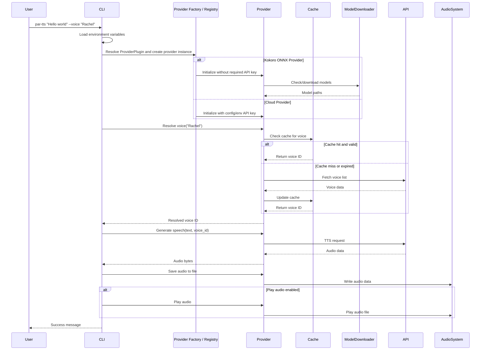

## Provider Abstraction Pattern

The provider abstraction pattern is the core architectural pattern that enables multi-provider support while maintaining a consistent interface.

### Class Hierarchy

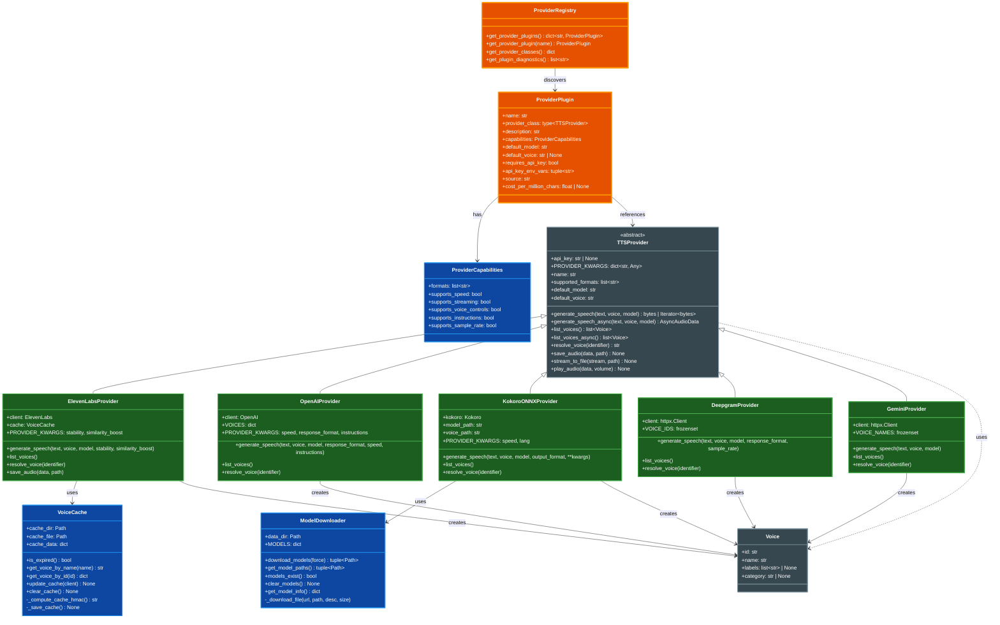

### Provider Registration

Providers are described by plugin descriptors in `par_tts/providers/registry.py`.
The public `PROVIDERS` mapping in `par_tts/providers/__init__.py` is retained for
backward compatibility, but it is now derived from plugin descriptors rather
than maintained as a hand-written source of truth.

```python
from par_tts.providers.base import ProviderCapabilities, ProviderPlugin

ProviderPlugin(
    name="openai",
    provider_class=OpenAIProvider,
    description="OpenAI",
    capabilities=ProviderCapabilities(
        formats=["mp3", "opus", "aac", "flac", "wav"],
        supports_speed=True,
        supports_instructions=True,
    ),
    default_model="gpt-4o-mini-tts",
    default_voice="nova",
    api_key_env_vars=("OPENAI_API_KEY",),
)
```

Third-party packages extend the registry with Python entry points:

```toml
[project.entry-points."par_tts.providers"]
my-provider = "my_package.tts:provider_plugin"
```

The entry point can load a `ProviderPlugin`, a zero-argument factory returning a
`ProviderPlugin`, or a `TTSProvider` subclass with plugin metadata attributes.
Discovery is error-isolated: one broken third-party plugin records diagnostics
but does not prevent built-in providers from loading.

### Provider Metadata Flow

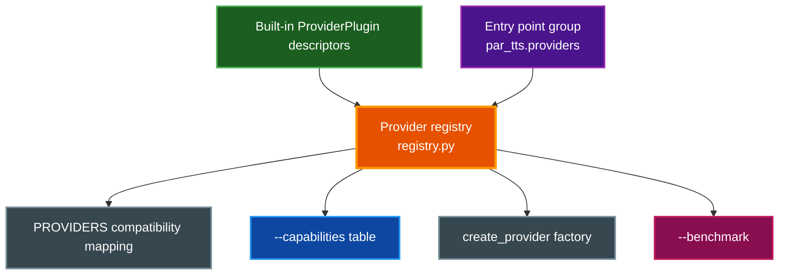

> **📝 Note:** Registry capabilities describe provider/library support that can be inspected without initializing providers. CLI-exposed generation options are a narrower set wired through Typer options and each provider class's `PROVIDER_KWARGS`; for example, Deepgram has provider-level `sample_rate` support, but there is not currently a top-level `--sample-rate` CLI flag.

## Data Flow

### TTS Request Processing Flow

```mermaid
flowchart TD
    Start([User Input]) --> Input{Input Type?}
    Input -->|Direct Text| Parse[Parse CLI Arguments]
    Input -->|Stdin Pipe / - / --watch-stdin| ReadStdin[Read from Stdin]
    Input -->|@filename| ReadFile[Read from File]
    Input -->|--from-clipboard| Clipboard[Read Clipboard]
    Input -->|--batch CSV/JSONL| Batch[Parse Batch Records]
    Input -->|--watch file/folder| Watch[Discover Watched Documents]

    ReadStdin --> Parse
    ReadFile --> Parse
    Clipboard --> Parse
    Batch --> Parse
    Watch --> Parse
    Parse --> LoadConfig[Load .env, Config File, and Profile]
    LoadConfig --> Operation{Operation type?}

    Operation -->|--capabilities| Capabilities[Render plugin capability matrix]
    Operation -->|--completion / --completion-install| Completions[Render shell completion script or install instructions]
    Operation -->|--list-voice-packs / --show-voice-pack| VoicePacks[Load packaged YAML via par_tts.voice_packs and render recommendations]
    Operation -->|doctor| Diagnostics[Run offline diagnostics]
    Operation -->|--dry-run / --estimate-cost| StaticOutput[Render static plan or cost estimate]
    Operation -->|Synthesis / Benchmark| SelectProvider[Resolve ProviderPlugin]
    Capabilities --> End
    Completions --> End
    VoicePacks --> End
    Diagnostics --> End
    StaticOutput --> End

    SelectProvider --> CreateProvider[Create provider from plugin metadata]
    CreateProvider --> TextProcess[Apply template variables and text processing]
    TextProcess --> ResolveVoice[Resolve Voice]

    ResolveVoice --> CachePath{Provider uses voice cache?}
    CachePath -->|ElevenLabs| CheckCache{Cache Valid?}
    CheckCache -->|No| FetchVoices[Fetch from API]
    FetchVoices --> UpdateCache[Update Cache]
    UpdateCache --> UseVoice
    CheckCache -->|Yes| UseVoice[Use Voice ID]
    CachePath -->|Other providers| UseVoice

    UseVoice --> BenchmarkDecision{Benchmark mode?}
    BenchmarkDecision -->|Yes| BenchmarkRun[Run repeated generation and collect latency/size/cost]
    BenchmarkRun --> End
    BenchmarkDecision -->|No| GenerateTTS[Generate TTS]
    GenerateTTS --> ReceiveAudio[Receive Audio Data]
    ReceiveAudio --> SaveDecision{Save to File?}
    SaveDecision -->|Yes| SaveFile[Save Audio File]
    SaveDecision -->|No| TempFile[Create Temp File]

    SaveFile --> PostProcess{Post-processing enabled?}
    TempFile --> PostProcess
    PostProcess -->|Yes| ProcessAudio[Apply ffmpeg filters]
    PostProcess -->|No| PlayDecision{Play Audio?}
    ProcessAudio --> PlayDecision

    PlayDecision -->|Yes| PlayAudio[Play Audio]
    PlayDecision -->|No| Skip[Skip Playback]

    PlayAudio --> Cleanup{Keep Temp Files?}
    Skip --> Cleanup

    Cleanup -->|No| DeleteTemp[Delete Temp Files]
    Cleanup -->|Yes| KeepTemp[Keep Files]

    DeleteTemp --> End([Complete])
    KeepTemp --> End

    style Start fill:#4a148c,stroke:#9c27b0,stroke-width:2px,color:#ffffff
    style Parse fill:#37474f,stroke:#78909c,stroke-width:2px,color:#ffffff
    style Clipboard fill:#37474f,stroke:#78909c,stroke-width:2px,color:#ffffff
    style Batch fill:#4a148c,stroke:#9c27b0,stroke-width:2px,color:#ffffff
    style Watch fill:#4a148c,stroke:#9c27b0,stroke-width:2px,color:#ffffff
    style LoadConfig fill:#37474f,stroke:#78909c,stroke-width:2px,color:#ffffff
    style Operation fill:#ff6f00,stroke:#ffa726,stroke-width:2px,color:#ffffff
    style Capabilities fill:#0d47a1,stroke:#2196f3,stroke-width:2px,color:#ffffff
    style Diagnostics fill:#0d47a1,stroke:#2196f3,stroke-width:2px,color:#ffffff
    style StaticOutput fill:#0d47a1,stroke:#2196f3,stroke-width:2px,color:#ffffff
    style SelectProvider fill:#ff6f00,stroke:#ffa726,stroke-width:2px,color:#ffffff
    style CreateProvider fill:#1b5e20,stroke:#4caf50,stroke-width:2px,color:#ffffff
    style TextProcess fill:#0d47a1,stroke:#2196f3,stroke-width:2px,color:#ffffff
    style ResolveVoice fill:#37474f,stroke:#78909c,stroke-width:2px,color:#ffffff
    style CachePath fill:#ff6f00,stroke:#ffa726,stroke-width:2px,color:#ffffff
    style BenchmarkDecision fill:#ff6f00,stroke:#ffa726,stroke-width:2px,color:#ffffff
    style BenchmarkRun fill:#880e4f,stroke:#c2185b,stroke-width:2px,color:#ffffff
    style CheckCache fill:#ff6f00,stroke:#ffa726,stroke-width:2px,color:#ffffff
    style FetchVoices fill:#880e4f,stroke:#c2185b,stroke-width:2px,color:#ffffff
    style UpdateCache fill:#0d47a1,stroke:#2196f3,stroke-width:2px,color:#ffffff
    style UseVoice fill:#37474f,stroke:#78909c,stroke-width:2px,color:#ffffff
    style GenerateTTS fill:#e65100,stroke:#ff9800,stroke-width:3px,color:#ffffff
    style ReceiveAudio fill:#37474f,stroke:#78909c,stroke-width:2px,color:#ffffff
    style PostProcess fill:#ff6f00,stroke:#ffa726,stroke-width:2px,color:#ffffff
    style ProcessAudio fill:#0d47a1,stroke:#2196f3,stroke-width:2px,color:#ffffff
    style SaveDecision fill:#ff6f00,stroke:#ffa726,stroke-width:2px,color:#ffffff
    style SaveFile fill:#0d47a1,stroke:#2196f3,stroke-width:2px,color:#ffffff
    style TempFile fill:#0d47a1,stroke:#2196f3,stroke-width:2px,color:#ffffff
    style PlayDecision fill:#ff6f00,stroke:#ffa726,stroke-width:2px,color:#ffffff
    style PlayAudio fill:#1b5e20,stroke:#4caf50,stroke-width:2px,color:#ffffff
    style Skip fill:#37474f,stroke:#78909c,stroke-width:2px,color:#ffffff
    style Cleanup fill:#ff6f00,stroke:#ffa726,stroke-width:2px,color:#ffffff
    style DeleteTemp fill:#37474f,stroke:#78909c,stroke-width:2px,color:#ffffff
    style KeepTemp fill:#37474f,stroke:#78909c,stroke-width:2px,color:#ffffff
    style End fill:#2e7d32,stroke:#66bb6a,stroke-width:2px,color:#ffffff
```

### ElevenLabs Voice Resolution Flow

The cache and 20-character ID heuristic are ElevenLabs-specific. OpenAI resolves against a static voice catalog, Kokoro ONNX resolves against local model voices, Deepgram resolves full IDs, prefixes, or speaker names, and Gemini resolves canonical prebuilt voice names.

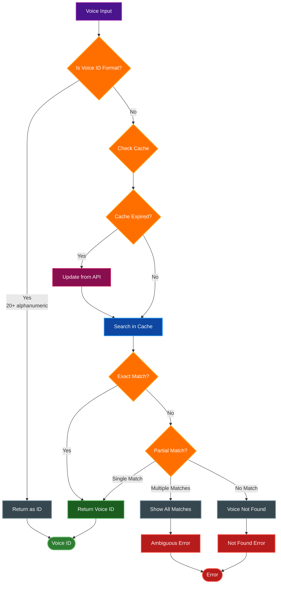

## Voice Caching System

The voice caching system optimizes API usage by storing voice metadata locally with intelligent expiry and update mechanisms.

### Cache Architecture

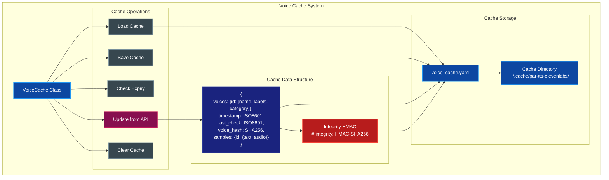

### Cache Lifecycle


## Model Management System

The model management system provides automatic downloading and storage of offline TTS models (like Kokoro ONNX) using XDG-compliant directories.

### Model Downloader Architecture

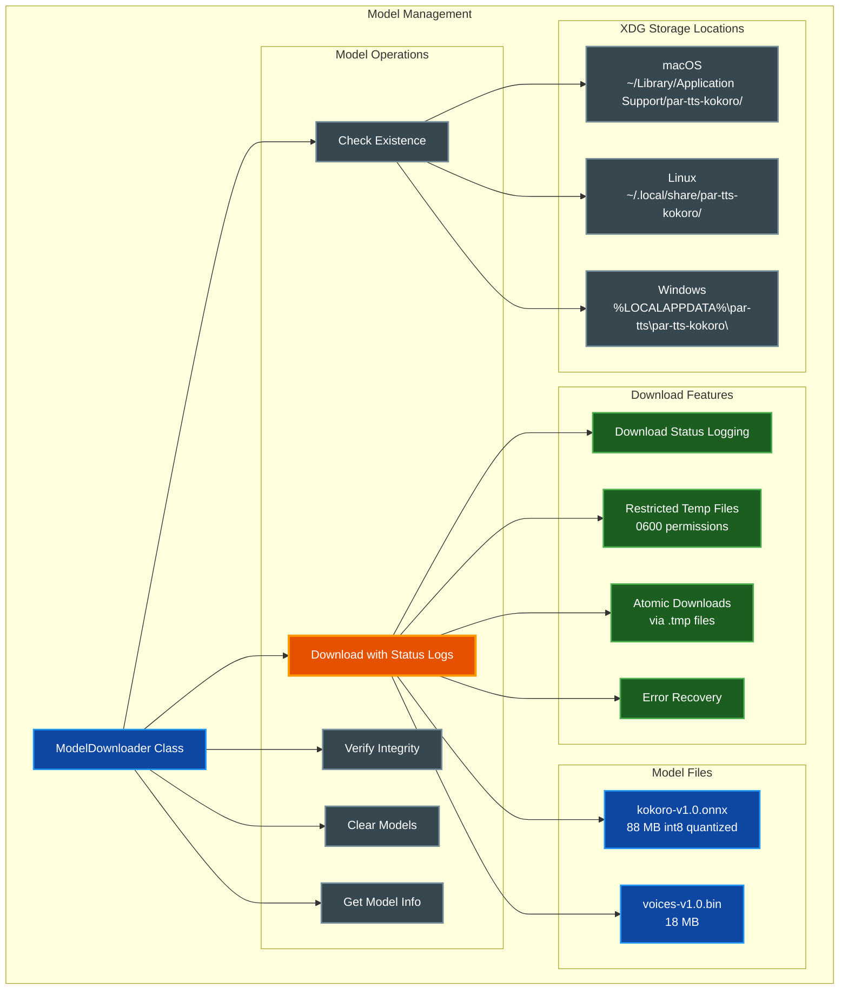

### Model Download Flow

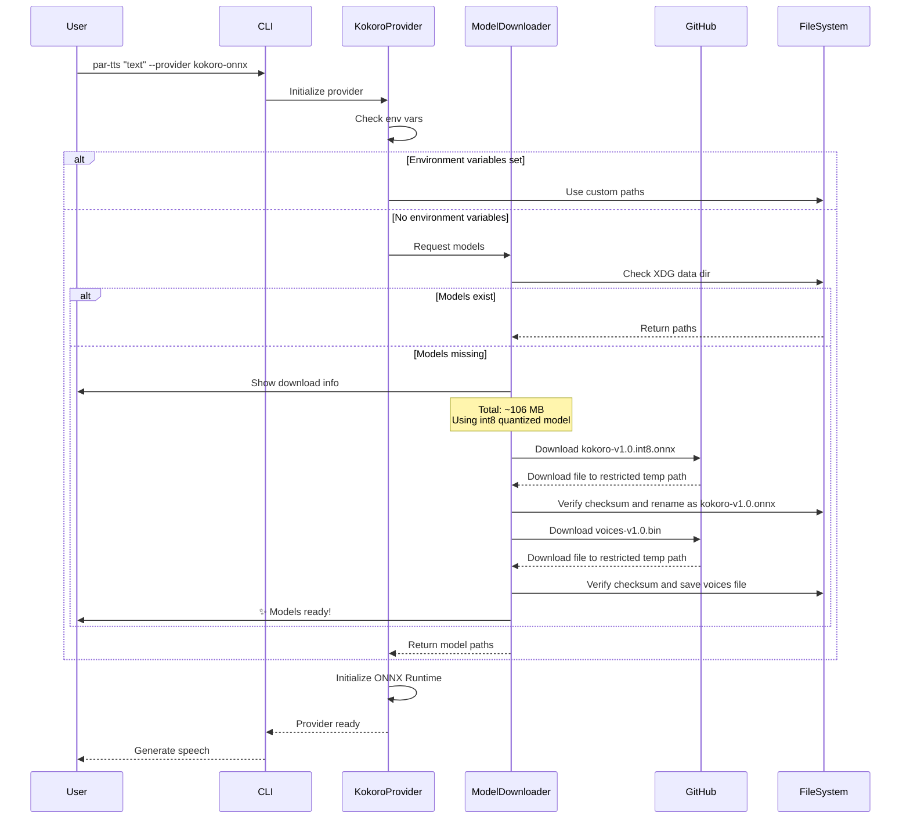

### Model CLI Management

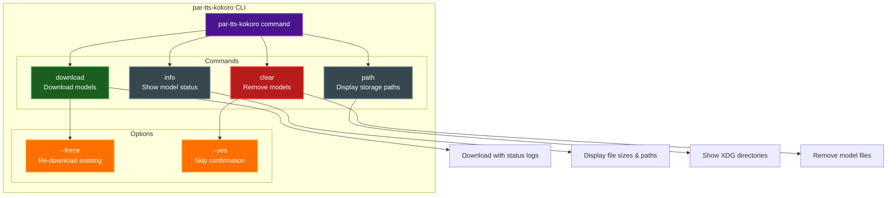

## Configuration Management

### Configuration Hierarchy

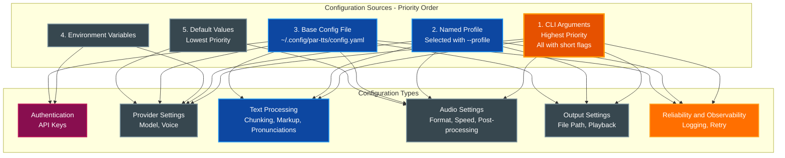

> **📝 Note:** CLI options have highest precedence. Typer also injects `TTS_PROVIDER` and `TTS_VOICE_ID` through CLI option environment-variable bindings, so those two environment variables behave like option values and can override config-file provider or voice settings. API key lookup is provider-specific: config-file key fields are checked before provider-declared environment variables.

### Environment Variables

| Variable | Description | Default | Required |
|----------|-------------|---------|----------|
| `ELEVENLABS_API_KEY` | ElevenLabs API authentication | - | Yes* |
| `OPENAI_API_KEY` | OpenAI API authentication | - | Yes* |
| `DEEPGRAM_API_KEY` | Deepgram API authentication (`DG_API_KEY` also accepted) | - | Yes* |
| `GEMINI_API_KEY` | Gemini API authentication (`GOOGLE_API_KEY` also accepted) | - | Yes* |
| `KOKORO_MODEL_PATH` | Path to Kokoro ONNX model file | Auto-download | No |
| `KOKORO_VOICE_PATH` | Path to Kokoro voice embeddings | Auto-download | No |
| `TTS_PROVIDER` | Default TTS provider | `kokoro-onnx` | No |
| `TTS_VOICE_ID` | Default voice (overrides provider-specific) | - | No |
| `ELEVENLABS_VOICE_ID` | Default ElevenLabs voice | `Juniper` | No |
| `OPENAI_VOICE_ID` | Default OpenAI voice | `nova` | No |
| `KOKORO_VOICE_ID` | Default Kokoro ONNX voice | `af_sarah` | No |
| `DEEPGRAM_VOICE_ID` | Default Deepgram voice | `aura-2-thalia-en` | No |
| `GEMINI_VOICE_ID` | Default Gemini voice | `Kore` | No |

*At least one API key is required for cloud providers (Kokoro ONNX works offline without API keys)

## Build and Deployment Architecture

### Build Pipeline

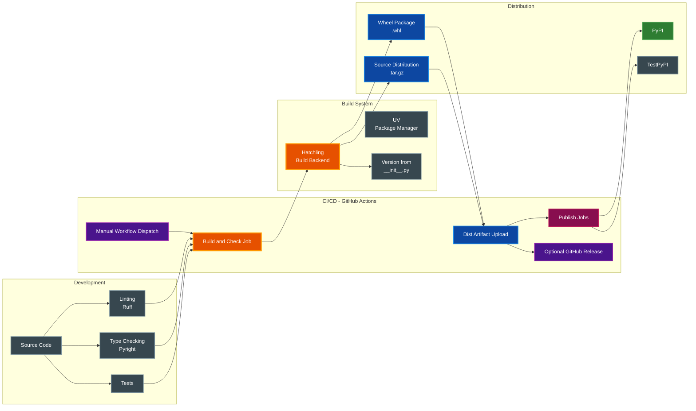

### GitHub Actions Workflows

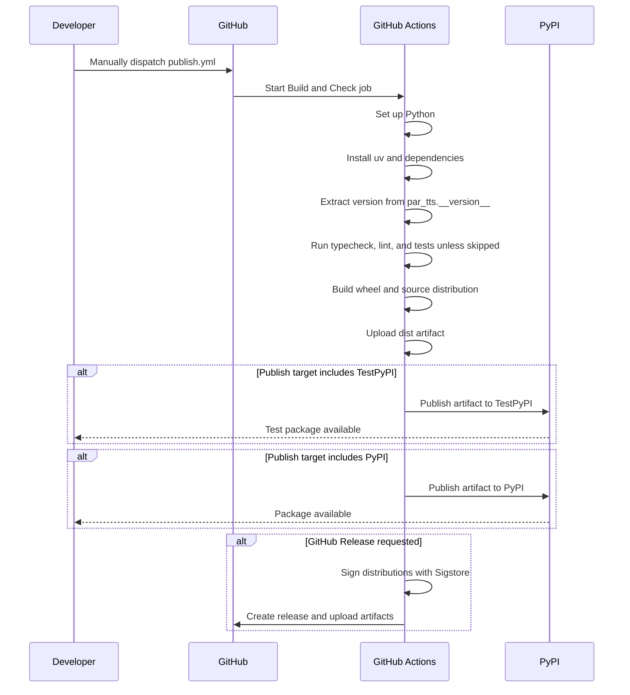

## Extension Points

### Adding a New Provider

The architecture supports two extension paths:

1. **External plugin package**: publish a package with a `par_tts.providers` entry point. This is the preferred path for third-party providers because users can install it without forking PAR CLI TTS.
2. **Built-in provider**: add an in-repository provider class and a built-in `ProviderPlugin` descriptor in `par_tts/providers/registry.py`.

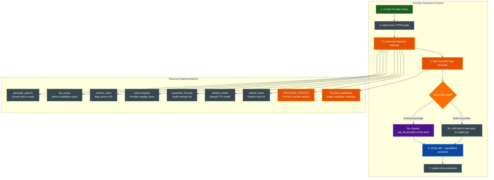

### Provider Template

```python
# my_package/tts.py
from collections.abc import Iterator
from typing import Any

from par_tts.providers.base import ProviderCapabilities, ProviderPlugin, TTSProvider, Voice


class NewProvider(TTSProvider):
    """New TTS provider implementation."""

    # Declare provider-specific kwargs accepted by generate_speech().
    # Keys are kwarg names; values are defaults.  The CLI uses this
    # mapping to build provider-specific option dicts without if/elif chains.
    PROVIDER_KWARGS = {
        "speed": 1.0,
    }

    def __init__(self, api_key: str | None = None, **kwargs: Any):
        super().__init__(api_key, **kwargs)
        # Initialize provider-specific client

    @property
    def name(self) -> str:
        return "NewProvider"

    @property
    def supported_formats(self) -> list[str]:
        return ["mp3", "wav"]

    @property
    def default_model(self) -> str:
        return "default-model-id"

    @property
    def default_voice(self) -> str:
        return "default-voice-id"

    def generate_speech(self, text: str, voice: str,
                       model: str | None = None, **kwargs: Any) -> bytes | Iterator[bytes]:
        # Implementation
        pass

    def list_voices(self) -> list[Voice]:
        # Implementation
        pass

    def resolve_voice(self, voice_identifier: str) -> str:
        # Implementation
        pass

    # save_audio() and play_audio() are provided by the TTSProvider base class.
    # Override them only if the provider needs custom handling (e.g. ElevenLabs SDK save).


provider_plugin = ProviderPlugin(
    name="new-provider",
    provider_class=NewProvider,
    description="New provider",
    capabilities=ProviderCapabilities(
        formats=["mp3", "wav"],
        supports_speed=True,
        supports_streaming=False,
        supports_voice_controls=False,
    ),
    default_model="default-model-id",
    default_voice="default-voice-id",
    requires_api_key=True,
    api_key_env_vars=("NEW_PROVIDER_API_KEY",),
    source="entry-point",
)
```

Expose the plugin from the provider package:

```toml
[project.entry-points."par_tts.providers"]
new-provider = "my_package.tts:provider_plugin"
```

## Error Handling and Recovery

### Error Handling Strategy

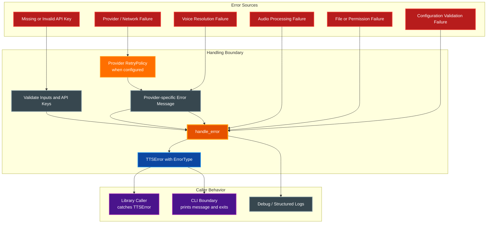

### Error Recovery Flow

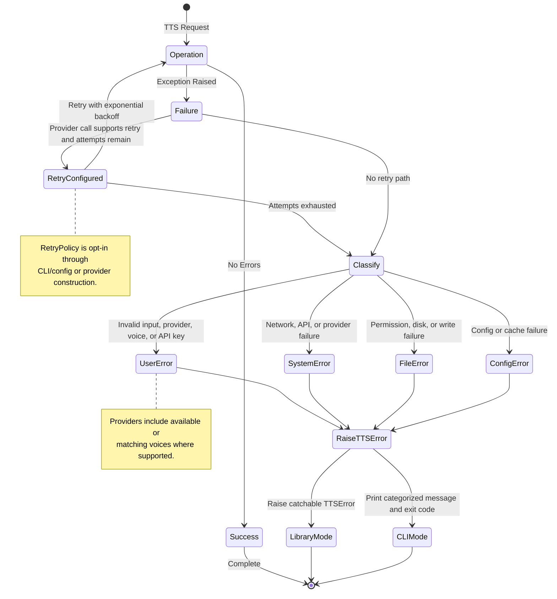

## Performance Considerations

### Performance Optimization Strategies

```mermaid
graph TB
    subgraph "Caching Strategies"
        VC[Voice Cache<br/>7-day TTL]
        VSC[Voice Sample Cache<br/>ElevenLabs previews]
        MC[Model File Cache<br/>Kokoro ONNX]
    end

    subgraph "Memory Optimization"
        STREAM["Iterator[bytes] Streaming"]
        DIRECT[Direct File Writing]
        CHUNK[Sentence-aware Chunking]
    end

    subgraph "Provider Operation Optimization"
        WORKFLOW[Batch and Watch Automation]
        APISTREAM[Streaming Responses]
        TIMEOUT[Request Timeouts]
        RETRY[Configurable Retry/Backoff]
    end

    subgraph "Resource Management"
        MEM[Memory Management<br/>Stream large files]
        TEMP[Temp File Cleanup]
        POST[Optional ffmpeg Post-processing]
        POOL[Connection Pooling]
    end

    subgraph "Library and Benchmark Support"
        ASYNC[Async Library API]
        MULTI[Multi-provider Benchmarking]
    end

    VC --> PERF[Performance<br/>Improvements]
    VSC --> PERF
    MC --> PERF

    STREAM --> PERF
    DIRECT --> PERF
    CHUNK --> PERF

    WORKFLOW --> PERF
    APISTREAM --> PERF
    TIMEOUT --> PERF
    RETRY --> PERF

    MEM --> PERF
    TEMP --> PERF
    POST --> PERF
    POOL --> PERF

    ASYNC --> PERF
    MULTI --> PERF

    style VC fill:#0d47a1,stroke:#2196f3,stroke-width:2px,color:#ffffff
    style VSC fill:#0d47a1,stroke:#2196f3,stroke-width:2px,color:#ffffff
    style MC fill:#0d47a1,stroke:#2196f3,stroke-width:2px,color:#ffffff
    style WORKFLOW fill:#4a148c,stroke:#9c27b0,stroke-width:2px,color:#ffffff
    style STREAM fill:#37474f,stroke:#78909c,stroke-width:2px,color:#ffffff
    style DIRECT fill:#37474f,stroke:#78909c,stroke-width:2px,color:#ffffff
    style CHUNK fill:#37474f,stroke:#78909c,stroke-width:2px,color:#ffffff
    style APISTREAM fill:#37474f,stroke:#78909c,stroke-width:2px,color:#ffffff
    style TIMEOUT fill:#37474f,stroke:#78909c,stroke-width:2px,color:#ffffff
    style RETRY fill:#37474f,stroke:#78909c,stroke-width:2px,color:#ffffff
    style MEM fill:#37474f,stroke:#78909c,stroke-width:2px,color:#ffffff
    style TEMP fill:#37474f,stroke:#78909c,stroke-width:2px,color:#ffffff
    style POST fill:#37474f,stroke:#78909c,stroke-width:2px,color:#ffffff
    style POOL fill:#37474f,stroke:#78909c,stroke-width:2px,color:#ffffff
    style ASYNC fill:#1b5e20,stroke:#4caf50,stroke-width:2px,color:#ffffff
    style MULTI fill:#1b5e20,stroke:#4caf50,stroke-width:2px,color:#ffffff
    style PERF fill:#2e7d32,stroke:#66bb6a,stroke-width:3px,color:#ffffff
```

### Performance Metrics

| Operation | Typical Duration | Optimization |
|-----------|-----------------|--------------|
| Voice Cache Hit | < 10ms | In-memory lookup |
| Voice Cache Miss | 500-1000ms | API call with caching |
| TTS Generation (100 chars) | 1-3s | Provider dependent |
| Audio Playback | Real-time | System audio buffer |
| File Write | < 100ms | Async I/O possible |
| Cache Expiry Check | < 1ms | Timestamp comparison |

### Bottleneck Analysis

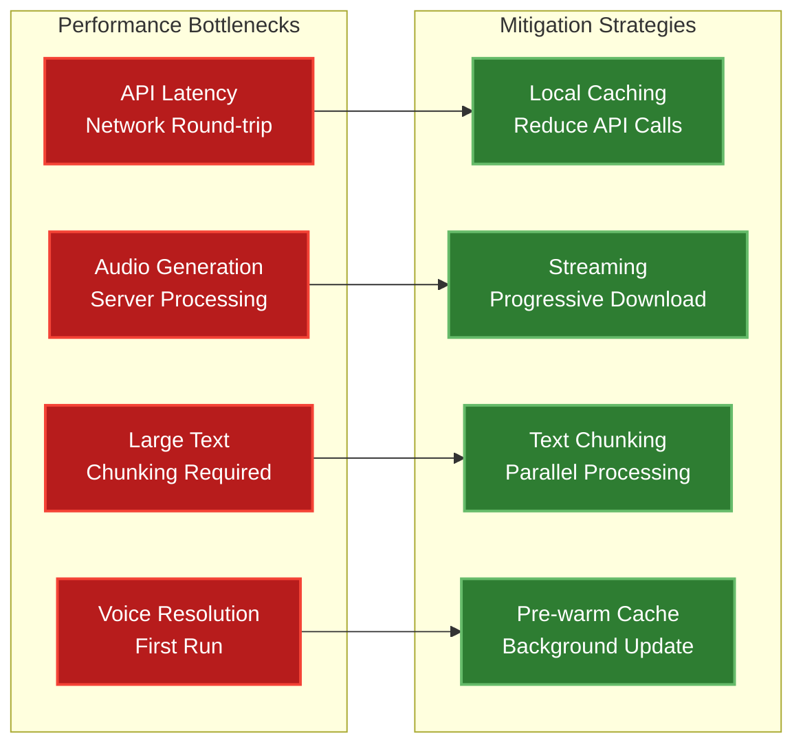

## Security Considerations

```mermaid
graph TB
    subgraph "Security Layers"
        subgraph "Authentication"
            KEYS[API Keys<br/>Environment Variables]
            VALID[Key Validation]
            ROTATE[Key Rotation Support]
            SANITIZE[Debug Output Sanitization]
        end

        subgraph "Data Protection"
            CACHE_SEC[Cache Security<br/>HMAC-SHA256 Integrity]
            TEMP_SEC[Temp File Handling<br/>Automatic Cleanup]
            AUDIO_SEC[Audio File Handling<br/>Local Save/Playback]
            CHECKSUM[SHA256 Verification<br/>Model Integrity]
            CONF_SEC[Config File Permissions<br/>0600 Owner-Only]
        end

        subgraph "Input Validation"
            TEXT_VAL[Text Sanitization]
            PATH_VAL[Path Traversal Prevention]
            CMD_VAL[Command Injection Prevention]
        end

        subgraph "Network Security"
            HTTPS[HTTPS Only]
            TIMEOUT[Request Timeouts]
            CERT[Certificate Validation]
        end
    end

    KEYS --> VALID
    CACHE_SEC --> INTEGRITY[HMAC Verification]
    CONF_SEC --> PERMS[Owner-only Permissions]
    TEXT_VAL --> ESCAPE[Special Character Handling]
    HTTPS --> TLS[TLS]

    style KEYS fill:#880e4f,stroke:#c2185b,stroke-width:2px,color:#ffffff
    style VALID fill:#37474f,stroke:#78909c,stroke-width:2px,color:#ffffff
    style ROTATE fill:#37474f,stroke:#78909c,stroke-width:2px,color:#ffffff
    style CACHE_SEC fill:#0d47a1,stroke:#2196f3,stroke-width:2px,color:#ffffff
    style TEMP_SEC fill:#0d47a1,stroke:#2196f3,stroke-width:2px,color:#ffffff
    style AUDIO_SEC fill:#0d47a1,stroke:#2196f3,stroke-width:2px,color:#ffffff
    style CHECKSUM fill:#0d47a1,stroke:#2196f3,stroke-width:2px,color:#ffffff
    style CONF_SEC fill:#0d47a1,stroke:#2196f3,stroke-width:2px,color:#ffffff
    style TEXT_VAL fill:#37474f,stroke:#78909c,stroke-width:2px,color:#ffffff
    style PATH_VAL fill:#37474f,stroke:#78909c,stroke-width:2px,color:#ffffff
    style CMD_VAL fill:#37474f,stroke:#78909c,stroke-width:2px,color:#ffffff
    style HTTPS fill:#1b5e20,stroke:#4caf50,stroke-width:2px,color:#ffffff
    style TIMEOUT fill:#37474f,stroke:#78909c,stroke-width:2px,color:#ffffff
    style CERT fill:#37474f,stroke:#78909c,stroke-width:2px,color:#ffffff
    style INTEGRITY fill:#37474f,stroke:#78909c,stroke-width:2px,color:#ffffff
    style PERMS fill:#37474f,stroke:#78909c,stroke-width:2px,color:#ffffff
    style ESCAPE fill:#37474f,stroke:#78909c,stroke-width:2px,color:#ffffff
    style TLS fill:#1b5e20,stroke:#4caf50,stroke-width:2px,color:#ffffff
```

## Future Enhancements

### Potential Roadmap Areas

Current implementation already includes async library helpers, batch/watch automation, retry/backoff controls, and lightweight language hints. Remaining roadmap areas focus on broader integrations and deeper runtime services.

```mermaid
flowchart TD
    Roadmap[Future Architecture Areas]
    Providers[Additional Cloud Providers<br/>Amazon Polly, Azure Speech, Google Cloud TTS]
    Voice[Voice Profile Management<br/>User presets and preferences]
    SSML[Full SSML Support<br/>Beyond lightweight markup]
    Streaming[Real-time Streaming<br/>Lower-latency playback]
    Cache[Advanced Caching<br/>Multi-tier and shared cache backends]
    Metrics[Persistent Metrics<br/>Usage, cost, and latency history]
    API[Web API Wrapper<br/>Service deployment mode]

    Roadmap --> Providers
    Roadmap --> Voice
    Roadmap --> SSML
    Roadmap --> Streaming
    Roadmap --> Cache
    Roadmap --> Metrics
    Roadmap --> API

    style Roadmap fill:#e65100,stroke:#ff9800,stroke-width:3px,color:#ffffff
    style Providers fill:#1b5e20,stroke:#4caf50,stroke-width:2px,color:#ffffff
    style Voice fill:#4a148c,stroke:#9c27b0,stroke-width:2px,color:#ffffff
    style SSML fill:#0d47a1,stroke:#2196f3,stroke-width:2px,color:#ffffff
    style Streaming fill:#880e4f,stroke:#c2185b,stroke-width:2px,color:#ffffff
    style Cache fill:#0d47a1,stroke:#2196f3,stroke-width:2px,color:#ffffff
    style Metrics fill:#ff6f00,stroke:#ffa726,stroke-width:2px,color:#ffffff
    style API fill:#37474f,stroke:#78909c,stroke-width:2px,color:#ffffff
```

### Recent Improvements

#### Current library/provider-oriented updates

1. **Async Library API**: Providers expose `generate_speech_async()` and `list_voices_async()` for async application integration
2. **Speech Callbacks**: `SpeechCallbacks` provides stable `on_chunk`, `on_progress`, `on_complete`, and `on_error` hooks
3. **Reusable SpeechPipeline**: Library users can preconfigure provider, voice, model, typed options, callbacks, text processing, and audio post-processing for repeated synthesis
4. **Public Provider Factory**: `create_provider()` uses plugin metadata and declared API-key environment variables without importing CLI modules
5. **Provider Option Schemas**: Typed provider option dataclasses validate values and are discoverable through `get_provider_option_schema()`
6. **Public Helper APIs**: Voice search, voice packs, cost estimation, diagnostics, errors, retry policy, and Kokoro model management are exposed as stable library helpers
7. **Provider Plugin Registry**: Built-in providers and third-party providers now share `ProviderPlugin` descriptors and a central registry
8. **Entry Point Discovery**: External packages can expose providers through the `par_tts.providers` entry point group
9. **Provider Capability Matrix**: `--capabilities` renders static provider capabilities without initializing providers or requiring API keys
10. **Voice Benchmark Mode**: `--benchmark` compares objective latency, output size, and estimated cost across selected providers
11. **Workflow Automation**: Clipboard input, watched stdin, batch files, docs-to-audio watch mode, templates, notification defaults, and timestamp exports share `par_tts.workflow` helpers
12. **Text and Audio Processing**: Chunking, lightweight markup, pronunciations, language hints, and ffmpeg-backed post-processing are reusable from CLI and library paths
13. **Reliability and Observability**: Structured logging, offline doctor diagnostics, generation summaries, and retry/backoff controls are available without changing provider implementations

#### Current Capability Baseline

Architecture-relevant capabilities now include:
1. **Library API Surface**: `par_tts` is an importable Python library with provider lookup, typed provider options, reusable pipelines, and public helper APIs
2. **Canonical Import Path**: `par_tts` is the canonical package, while legacy imports remain compatibility-focused
3. **Rich-Decoupled Library Modules**: Library modules use stdlib logging instead of Rich console dependencies
4. **Cloud and Offline Providers**: ElevenLabs, OpenAI, Deepgram, Gemini, and Kokoro ONNX share provider abstractions and registry metadata
5. **Per-Provider Voice Configuration**: The `voices:` mapping prevents voice bleed across providers
6. **Cross-Platform Audio Playback**: Dedicated audio playback supports macOS, Linux, and Windows paths where system players are available
7. **Configuration and API-Key Support**: YAML config files can store defaults, profiles, per-provider voices, and provider API keys with owner-only config-file permissions
8. **Voice Cache and Model Integrity**: ElevenLabs voice metadata uses cache hashing and HMAC integrity checks; Kokoro downloads use SHA256 model verification
9. **Input and Workflow Flexibility**: Direct text, stdin, file input, clipboard, batch files, watched stdin, and watched document folders are all supported
10. **Streaming and Memory Efficiency**: Providers can return iterators, and audio streams directly to files without full buffering when supported

> **📝 Note:** Release-specific history belongs in [CHANGELOG.md](../CHANGELOG.md); this section summarizes current architecture capabilities without storing package version milestones.

### Planned Architecture Improvements

1. **Cost Tracking**: Persist and aggregate API usage costs beyond per-run static estimates
2. **Better Progress Feedback**: Show progress for long text processing and multi-segment synthesis
3. **Voice Profile Management**: User-specific voice preferences and reusable presets beyond config profiles
4. **Advanced Caching**: Multi-tier caching with optional shared cache backends
5. **Monitoring and Metrics**: Performance tracking and usage analytics beyond local benchmark output
6. **Web API**: RESTful API wrapper for CLI and library functionality
7. **Voice Marketplace**: Integration with voice model marketplaces
8. **Advanced Multi-language Support**: Provider-aware language detection, validation, and switching beyond current script hints

## Conclusion

The PAR CLI TTS architecture provides a robust, extensible foundation for multi-provider text-to-speech operations. The provider abstraction pattern ensures easy integration of new services, while the caching system optimizes performance and reduces API costs. The modular design allows for independent evolution of components while maintaining system cohesion.

Key architectural achievements:
- **Provider Independence**: Core logic is decoupled from provider implementations
- **Performance Optimization**: Intelligent caching reduces latency and API calls
- **User Experience**: Rich CLI feedback with helpful error messages
- **Maintainability**: Type-safe, well-documented code with clear separation of concerns
- **Extensibility**: New providers can be added as third-party entry-point plugins or built-in descriptors with minimal code changes

This architecture positions PAR CLI TTS for future growth while maintaining stability and performance for current users.

## Related Documentation

- [README.md](../README.md) - Project overview and installation guide
- [CHANGELOG.md](../CHANGELOG.md) - Version history and release notes
- [CLAUDE.md](../CLAUDE.md) - Development guide and code conventions
- [DOCUMENTATION_STYLE_GUIDE.md](DOCUMENTATION_STYLE_GUIDE.md) - Documentation standards for this project
- [pyproject.toml](../pyproject.toml) - Project configuration and dependencies
