# PAR CLI TTS Architecture Documentation

This document provides a comprehensive overview of the PAR CLI TTS system architecture, including component design, data flow, provider abstraction patterns, and extension points for adding new TTS providers.

## Table of Contents

1. [System Overview](#system-overview)
2. [Component Architecture](#component-architecture)
3. [Provider Abstraction Pattern](#provider-abstraction-pattern)
4. [Data Flow](#data-flow)
5. [Voice Caching System](#voice-caching-system)
6. [Configuration Management](#configuration-management)
7. [Build and Deployment Architecture](#build-and-deployment-architecture)
8. [Extension Points](#extension-points)
9. [Error Handling and Recovery](#error-handling-and-recovery)
10. [Performance Considerations](#performance-considerations)

## System Overview

PAR CLI TTS is a command-line text-to-speech tool that provides a unified interface for multiple TTS providers including cloud-based (ElevenLabs, OpenAI, Deepgram, Google Gemini) and offline (Kokoro ONNX) solutions. The architecture follows a provider abstraction pattern, enabling seamless integration of different TTS services while maintaining a consistent user experience.

### High-Level Architecture

```mermaid
graph TB
    subgraph "User Interface Layer"
        CLI[CLI Interface<br/>cli/tts_cli.py]
        KCLI[Kokoro CLI<br/>cli/kokoro_cli.py]
        ENV[Environment Variables<br/>.env]
        CONF[Config File<br/>~/.config/par-tts/config.yaml]
    end

    subgraph "Core Application Layer"
        PM[Provider Manager]
        VC[Voice Cache<br/>voice_cache.py]
        MD[Model Downloader<br/>model_downloader.py]
        CFG[Configuration Manager<br/>cli/config_file.py]
        ERR[Error Handler<br/>errors.py]
        UTIL[Utilities<br/>utils.py]
        AUDIO[Audio Playback<br/>audio.py]
        CONS[Console<br/>cli/console.py]
        HTTP[HTTP Client<br/>http_client.py]
        DFLT[Defaults<br/>defaults.py]
    end

    subgraph "Provider Abstraction Layer"
        BASE[TTSProvider<br/>Abstract Base Class]
        EL[ElevenLabsProvider]
        OA[OpenAIProvider]
        KO[KokoroONNXProvider]
        DG[DeepgramProvider]
        GM[GeminiProvider]
        FP[Future Providers<br/>...]
    end

    subgraph "External Services"
        ELAPI[ElevenLabs API]
        OAAPI[OpenAI API]
        ONNX[ONNX Runtime<br/>Local]
        DGAPI[Deepgram API]
        GMAPI[Gemini API]
        FAPI[Future APIs<br/>...]
    end

    subgraph "Storage Layer"
        CACHE[(Voice Cache<br/>YAML)]
        MODELS[(Model Files<br/>ONNX/BIN)]
        AUDIO[Audio Files<br/>MP3/WAV/etc]
    end

    CLI --> PM
    CLI --> CFG
    CLI --> ERR
    CLI --> CONS
    KCLI --> MD
    KCLI --> CONS
    ENV --> CFG
    CONF --> CFG
    PM --> BASE
    PM --> UTIL
    PM --> DFLT
    BASE --> AUDIO
    BASE --> EL
    BASE --> OA
    BASE --> KO
    BASE --> DG
    BASE --> GM
    BASE --> FP
    EL --> VC
    EL --> ELAPI
    EL --> HTTP
    OA --> OAAPI
    OA --> HTTP
    KO --> MD
    KO --> ONNX
    DG --> DGAPI
    DG --> HTTP
    GM --> GMAPI
    GM --> HTTP
    FP --> FAPI
    VC --> CACHE
    MD --> MODELS
    EL --> AUDIO
    OA --> AUDIO
    KO --> AUDIO
    DG --> AUDIO
    GM --> AUDIO
    ERR --> CONS

    style CLI fill:#4a148c,stroke:#9c27b0,stroke-width:2px,color:#ffffff
    style KCLI fill:#4a148c,stroke:#9c27b0,stroke-width:2px,color:#ffffff
    style ENV fill:#37474f,stroke:#78909c,stroke-width:2px,color:#ffffff
    style PM fill:#e65100,stroke:#ff9800,stroke-width:3px,color:#ffffff
    style VC fill:#0d47a1,stroke:#2196f3,stroke-width:2px,color:#ffffff
    style MD fill:#0d47a1,stroke:#2196f3,stroke-width:2px,color:#ffffff
    style CONF fill:#37474f,stroke:#78909c,stroke-width:2px,color:#ffffff
    style CFG fill:#e65100,stroke:#ff9800,stroke-width:3px,color:#ffffff
    style ERR fill:#b71c1c,stroke:#f44336,stroke-width:2px,color:#ffffff
    style UTIL fill:#0d47a1,stroke:#2196f3,stroke-width:2px,color:#ffffff
    style CONS fill:#37474f,stroke:#78909c,stroke-width:2px,color:#ffffff
    style AUDIO fill:#37474f,stroke:#78909c,stroke-width:2px,color:#ffffff
    style HTTP fill:#37474f,stroke:#78909c,stroke-width:2px,color:#ffffff
    style DFLT fill:#37474f,stroke:#78909c,stroke-width:2px,color:#ffffff
    style BASE fill:#37474f,stroke:#78909c,stroke-width:2px,color:#ffffff
    style EL fill:#1b5e20,stroke:#4caf50,stroke-width:2px,color:#ffffff
    style OA fill:#1b5e20,stroke:#4caf50,stroke-width:2px,color:#ffffff
    style KO fill:#1b5e20,stroke:#4caf50,stroke-width:2px,color:#ffffff
    style DG fill:#1b5e20,stroke:#4caf50,stroke-width:2px,color:#ffffff
    style GM fill:#1b5e20,stroke:#4caf50,stroke-width:2px,color:#ffffff
    style FP fill:#37474f,stroke:#78909c,stroke-width:2px,color:#ffffff
    style ELAPI fill:#880e4f,stroke:#c2185b,stroke-width:2px,color:#ffffff
    style OAAPI fill:#880e4f,stroke:#c2185b,stroke-width:2px,color:#ffffff
    style ONNX fill:#0d47a1,stroke:#2196f3,stroke-width:2px,color:#ffffff
    style DGAPI fill:#880e4f,stroke:#c2185b,stroke-width:2px,color:#ffffff
    style GMAPI fill:#880e4f,stroke:#c2185b,stroke-width:2px,color:#ffffff
    style FAPI fill:#880e4f,stroke:#c2185b,stroke-width:2px,color:#ffffff
    style CACHE fill:#0d47a1,stroke:#2196f3,stroke-width:2px,color:#ffffff
    style MODELS fill:#0d47a1,stroke:#2196f3,stroke-width:2px,color:#ffffff
    style AUDIO fill:#0d47a1,stroke:#2196f3,stroke-width:2px,color:#ffffff
```

### Key Design Principles

1. **Provider Agnostic**: Core logic is independent of specific TTS providers
2. **Extensible**: New providers can be added without modifying existing code
3. **Cached Operations**: Voice data is cached to minimize API calls
4. **Environment-First Configuration**: Uses environment variables for sensitive data
5. **Type-Safe**: Comprehensive type hints throughout the codebase
6. **User-Friendly**: Rich CLI output with helpful error messages
7. **Cross-Platform**: Full support for macOS, Linux, and Windows with volume control
8. **Offline-First**: Kokoro ONNX as default provider for zero-latency offline usage

## Component Architecture

### Core Components

#### 1. CLI Interface (`par_tts/cli/tts_cli.py`)

The main entry point that handles:
- Command-line argument parsing using Typer with short flags
- Multiple input methods (direct text, stdin, @filename)
- Provider selection and initialization
- Voice resolution and validation
- Voice preview functionality
- Metadata-only shell completion helpers (`--completion`, `--completion-install`)
- Metadata-only bundled voice-pack listing/display (`--list-voice-packs`, `--show-voice-pack`)
- Audio generation orchestration with streaming
- Volume control for playback
- File management and cleanup
- Sanitized debug output

**Related CLIs:**
- `par-tts`: Main text-to-speech conversion
- `par-tts-kokoro`: Kokoro ONNX model management
- `par-tts-install-style`: Install TTS Summary output style for Claude Code
  - Copies output style to `~/.claude/output-styles/`
  - Updates `~/.claude/settings.json` with required permissions
  - Prompts for user name to personalize audio summaries

#### 2. Provider Abstraction (`par_tts/providers/base.py`)

Abstract base class defining the provider interface:
- Speech generation with Iterator[bytes] support
- Voice listing and resolution
- Default `save_audio()` and `play_audio()` implementations in the base class (providers override only when needed, e.g. ElevenLabs SDK save)
- Volume control for playback
- `PROVIDER_KWARGS` class attribute for declaring provider-specific options
- Provider metadata
- Optional API key for offline providers
- Per-provider options dataclasses: `ElevenLabsOptions`, `OpenAIOptions`, `KokoroOptions`, `DeepgramOptions`, `GeminiOptions`

#### 3. Provider Implementations

**ElevenLabs Provider (`par_tts/providers/elevenlabs.py`)**
- Voice caching support with change detection
- Advanced voice settings (stability, similarity boost)
- Streaming audio generation (Iterator[bytes])
- Voice sample caching for offline preview
- Default model: eleven_multilingual_v2
- Default voice: Juniper
- Supported formats: mp3, pcm, ulaw

**OpenAI Provider (`par_tts/providers/openai.py`)**
- Multiple audio formats (mp3, opus, aac, flac, wav)
- Variable speech speed (0.25 to 4.0)
- 13 voice options (alloy, ash, ballad, coral, echo, fable, nova, onyx, sage, shimmer, verse, marin, cedar)
- gpt-4o-mini-tts model with voice instructions support
- Simple voice selection with case-insensitive matching
- Default model: gpt-4o-mini-tts
- Default voice: nova

**Kokoro ONNX Provider (`par_tts/providers/kokoro_onnx.py`)**
- Offline TTS using ONNX Runtime (no API key required)
- Automatic model downloading with SHA256 verification
- XDG-compliant model storage (~106 MB download)
- Multiple voice styles with language support
- Speed control (default: 1.0)
- Language code support (default: en-us)
- Multiple output formats (wav, flac, ogg)
- Default voice: af_sarah

**Deepgram Provider (`par_tts/providers/deepgram.py`)**
- REST `/v1/speak` integration via httpx (no SDK dependency)
- Aura and Aura-2 voice catalog (English, Spanish, Dutch, French, German, Italian, Japanese)
- Streaming chunked download — audio writes to file as it arrives
- Voice resolution accepts full ID, ID prefix, or speaker name
- Default model/voice: aura-2-thalia-en
- Supported formats: mp3, wav, flac, opus, aac

**Gemini Provider (`par_tts/providers/gemini.py`)**
- REST `generateContent` with `responseModalities: ["AUDIO"]` via httpx (no SDK dependency)
- 30 prebuilt voices with style descriptors (Zephyr, Puck, Kore, Aoede, etc.)
- Raw 24 kHz 16-bit mono PCM wrapped in WAV header
- Case-insensitive voice name resolution with partial matching
- Default model: gemini-2.5-flash-preview-tts
- Default voice: Kore
- Supported formats: wav

#### 4. Voice Cache System (`par_tts/voice_cache.py`)

Intelligent caching layer for voice data:
- XDG-compliant storage
- 7-day expiry policy with change detection
- Automatic cache invalidation via content hashing
- HMAC-SHA256 integrity verification on load and save
- Fuzzy voice name matching
- Voice sample caching for offline preview
- Manual cache refresh (--refresh-cache)
- Sample cache management (--clear-cache-samples)

#### 5. Model Downloader (`par_tts/model_downloader.py`)

Automatic model management for offline providers:
- XDG-compliant data storage
- Progress indicators with transfer speeds
- Automatic download on first use
- SHA256 checksum verification
- Model verification and cleanup
- ~106 MB total download size for Kokoro ONNX

#### 6. Utility Functions (`par_tts/utils.py`)

Common utilities for the application:
- `stream_to_file()`: Memory-efficient streaming
- `sanitize_debug_output()`: API key masking for debug output
- `verify_file_checksum()`: SHA256 verification
- `calculate_file_checksum()`: Checksum generation
- `looks_like_voice_id()`: Detect if string is a voice ID vs name

#### 7. Audio Playback (`par_tts/audio.py`)

Dedicated module for cross-platform audio playback (extracted from utils for library use):
- `play_audio_with_player()`: Cross-platform audio playback with volume
- `_find_windows_audio_player()`: Detect available Windows audio player
- `_play_with_powershell()`: Windows PowerShell MediaPlayer fallback
- `_play_audio_windows()`: Windows-specific audio playback
- `play_audio_bytes()`: Play audio from bytes using system player

#### 8. Configuration File Manager (`par_tts/cli/config_file.py`)

YAML-based configuration file support:
- `ConfigFile`: Pydantic model for config structure with validation
- `ConfigManager`: Load, validate, and merge configurations
- XDG-compliant config location (~/.config/par-tts/config.yaml; `~/Library/Application Support/par-tts/config.yaml` on macOS)
- Sample config generation (`--create-config`, with confirmation before overwrite; `-y/--yes` to skip the prompt)
- Per-provider voice mapping (`voices:`) keyed by provider name
- CLI argument precedence over config file
- Configuration schema validation with Pydantic (rejects unknown providers in `voices:`)
- Config file permissions enforced to 0600 (owner-only read/write)

#### 9. Error Handling Module (`par_tts/errors.py`)

Centralized error management:
- `ErrorType`: Enum for categorized exit codes (User: 1, System: 2, File: 3, Config: 4)
- `TTSError`: Base exception class for TTS-specific errors
- `handle_error()`: Log error via stdlib logging and raise `TTSError` (library mode) or call `sys.exit()` when `exit_on_error=True` (CLI mode)
- `set_debug_mode()` / `_debug_mode`: Thread-safe debug flag using `contextvars.ContextVar`
- `validate_api_key()`: API key validation for cloud providers
- `validate_file_path()`: File path validation with security checks

#### 10. Default Values (`par_tts/defaults.py`)

Centralized default configuration values:
- `DEFAULT_PROVIDER`: kokoro-onnx
- `DEFAULT_ELEVENLABS_VOICE`: Juniper
- `DEFAULT_OPENAI_VOICE`: nova
- `DEFAULT_KOKORO_VOICE`: af_sarah
- `DEFAULT_DEEPGRAM_VOICE`: aura-2-thalia-en
- `DEFAULT_GEMINI_VOICE`: Kore
- `get_default_voice()`: Get default voice for a provider (checks env vars first)

#### 11. Console Output (`par_tts/cli/console.py`)

Shared console instances for consistent output:
- `console`: Standard output Console instance (stdout)
- `error_console`: Error output Console instance (stderr)

#### 12. Voice-Pack Metadata (`par_tts/voice_packs.py`, `par_tts/data/voice_packs.yaml`)

Bundled voice-pack metadata for provider/voice recommendations:
- Packaged YAML resource loaded with `importlib.resources` through `par_tts.voice_packs`
- Strict validation into typed `VoicePack` and `VoicePackRecommendation` dataclasses
- Metadata-only CLI operations (`--list-voice-packs`, `--show-voice-pack`) that run before provider creation and require no API keys
- Use-case packs for alerts, assistant, narration, and storytelling

#### 13. Shell Completion Helpers (`par_tts/cli/completions.py`)

Completion support kept separate from synthesis logic:
- Supports bash, zsh, and fish validation/normalization
- Generates Typer/Click completion scripts for `par-tts`
- Renders shell-specific install instructions (`--completion-install`) without provider creation

#### 14. HTTP Client Factory (`par_tts/http_client.py`)

HTTP client creation with consistent configuration:
- `create_http_client()`: Factory function for httpx.Client
- Configurable timeout (default: 10 seconds)
- SSL verification options

#### 15. Kokoro Model CLI (`par_tts/cli/kokoro_cli.py`)

Dedicated CLI for Kokoro ONNX model management:
- `download`: Download model files with --force option
- `info`: Show model information and status
- `clear`: Remove downloaded models with confirmation
- `path`: Display model storage paths

### Component Interaction Diagram

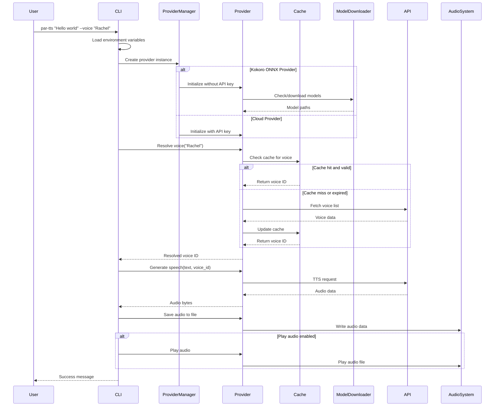

## Provider Abstraction Pattern

The provider abstraction pattern is the core architectural pattern that enables multi-provider support while maintaining a consistent interface.

### Class Hierarchy

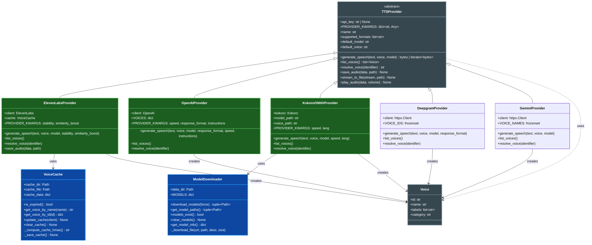

### Provider Registration

Providers are registered in a central registry (`par_tts/providers/__init__.py`):

```python
PROVIDERS = {
    "elevenlabs": ElevenLabsProvider,
    "openai": OpenAIProvider,
    "kokoro-onnx": KokoroONNXProvider,
    "deepgram": DeepgramProvider,
    "gemini": GeminiProvider,
    # Future providers added here
}
```

## Data Flow

### TTS Request Processing Flow

```mermaid
flowchart TD
    Start([User Input]) --> Input{Input Type?}
    Input -->|Direct Text| Parse[Parse CLI Arguments]
    Input -->|Stdin Pipe| ReadStdin[Read from Stdin]
    Input -->|@filename| ReadFile[Read from File]

    ReadStdin --> Parse
    ReadFile --> Parse
    Parse --> LoadEnv[Load Environment Variables]
    LoadEnv --> Operation{Metadata-only operation?}
    Operation -->|--completion / --completion-install| Completions[Render shell completion script or install instructions]
    Operation -->|--list-voice-packs / --show-voice-pack| VoicePacks[Load packaged YAML via par_tts.voice_packs and render recommendations]
    Operation -->|Synthesis| SelectProvider{Select Provider}
    Completions --> End
    VoicePacks --> End

    SelectProvider -->|ElevenLabs| CreateEL[Create ElevenLabs Provider]
    SelectProvider -->|OpenAI| CreateOA[Create OpenAI Provider]
    SelectProvider -->|Kokoro ONNX| CreateKO[Create Kokoro ONNX Provider]
    SelectProvider -->|Deepgram| CreateDG[Create Deepgram Provider]
    SelectProvider -->|Gemini| CreateGM[Create Gemini Provider]

    CreateEL --> ResolveVoiceEL[Resolve Voice with Cache]
    CreateOA --> ResolveVoiceOA[Resolve Voice Direct]
    CreateKO --> ResolveVoiceKO[Resolve Voice Local]
    CreateDG --> ResolveVoiceDG[Resolve Voice Name/ID]
    CreateGM --> ResolveVoiceGM[Resolve Voice Name]

    ResolveVoiceEL --> CheckCache{Cache Valid?}
    CheckCache -->|No| FetchVoices[Fetch from API]
    FetchVoices --> UpdateCache[Update Cache]
    UpdateCache --> UseVoice
    CheckCache -->|Yes| UseVoice[Use Voice ID]

    ResolveVoiceOA --> UseVoice
    ResolveVoiceKO --> UseVoice
    ResolveVoiceDG --> UseVoice
    ResolveVoiceGM --> UseVoice

    UseVoice --> GenerateTTS[Generate TTS]
    GenerateTTS --> ReceiveAudio[Receive Audio Data]

    ReceiveAudio --> SaveDecision{Save to File?}
    SaveDecision -->|Yes| SaveFile[Save Audio File]
    SaveDecision -->|No| TempFile[Create Temp File]

    SaveFile --> PlayDecision{Play Audio?}
    TempFile --> PlayDecision

    PlayDecision -->|Yes| PlayAudio[Play Audio]
    PlayDecision -->|No| Skip[Skip Playback]

    PlayAudio --> Cleanup{Keep Temp Files?}
    Skip --> Cleanup

    Cleanup -->|No| DeleteTemp[Delete Temp Files]
    Cleanup -->|Yes| KeepTemp[Keep Files]

    DeleteTemp --> End([Complete])
    KeepTemp --> End

    style Start fill:#4a148c,stroke:#9c27b0,stroke-width:2px,color:#ffffff
    style Parse fill:#37474f,stroke:#78909c,stroke-width:2px,color:#ffffff
    style LoadEnv fill:#37474f,stroke:#78909c,stroke-width:2px,color:#ffffff
    style SelectProvider fill:#ff6f00,stroke:#ffa726,stroke-width:2px,color:#ffffff
    style CreateEL fill:#1b5e20,stroke:#4caf50,stroke-width:2px,color:#ffffff
    style CreateOA fill:#1b5e20,stroke:#4caf50,stroke-width:2px,color:#ffffff
    style CreateKO fill:#1b5e20,stroke:#4caf50,stroke-width:2px,color:#ffffff
    style CreateDG fill:#1b5e20,stroke:#4caf50,stroke-width:2px,color:#ffffff
    style CreateGM fill:#1b5e20,stroke:#4caf50,stroke-width:2px,color:#ffffff
    style ResolveVoiceEL fill:#37474f,stroke:#78909c,stroke-width:2px,color:#ffffff
    style ResolveVoiceOA fill:#37474f,stroke:#78909c,stroke-width:2px,color:#ffffff
    style ResolveVoiceKO fill:#37474f,stroke:#78909c,stroke-width:2px,color:#ffffff
    style ResolveVoiceDG fill:#37474f,stroke:#78909c,stroke-width:2px,color:#ffffff
    style ResolveVoiceGM fill:#37474f,stroke:#78909c,stroke-width:2px,color:#ffffff
    style CheckCache fill:#ff6f00,stroke:#ffa726,stroke-width:2px,color:#ffffff
    style FetchVoices fill:#880e4f,stroke:#c2185b,stroke-width:2px,color:#ffffff
    style UpdateCache fill:#0d47a1,stroke:#2196f3,stroke-width:2px,color:#ffffff
    style UseVoice fill:#37474f,stroke:#78909c,stroke-width:2px,color:#ffffff
    style GenerateTTS fill:#e65100,stroke:#ff9800,stroke-width:3px,color:#ffffff
    style ReceiveAudio fill:#37474f,stroke:#78909c,stroke-width:2px,color:#ffffff
    style SaveDecision fill:#ff6f00,stroke:#ffa726,stroke-width:2px,color:#ffffff
    style SaveFile fill:#0d47a1,stroke:#2196f3,stroke-width:2px,color:#ffffff
    style TempFile fill:#0d47a1,stroke:#2196f3,stroke-width:2px,color:#ffffff
    style PlayDecision fill:#ff6f00,stroke:#ffa726,stroke-width:2px,color:#ffffff
    style PlayAudio fill:#1b5e20,stroke:#4caf50,stroke-width:2px,color:#ffffff
    style Skip fill:#37474f,stroke:#78909c,stroke-width:2px,color:#ffffff
    style Cleanup fill:#ff6f00,stroke:#ffa726,stroke-width:2px,color:#ffffff
    style DeleteTemp fill:#37474f,stroke:#78909c,stroke-width:2px,color:#ffffff
    style KeepTemp fill:#37474f,stroke:#78909c,stroke-width:2px,color:#ffffff
    style End fill:#2e7d32,stroke:#66bb6a,stroke-width:2px,color:#ffffff
```

### Voice Resolution Flow


## Voice Caching System

The voice caching system optimizes API usage by storing voice metadata locally with intelligent expiry and update mechanisms.

### Cache Architecture

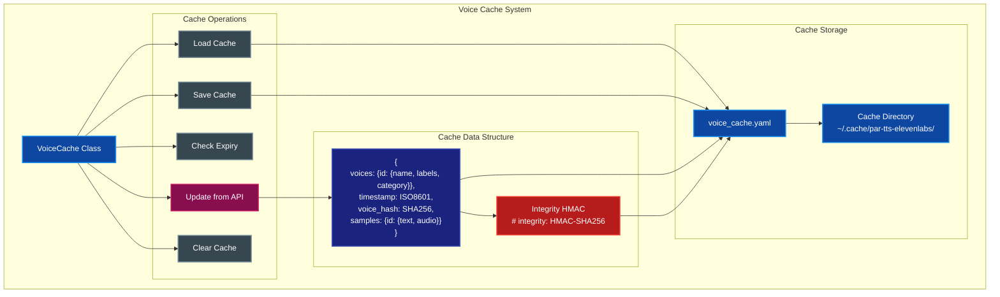

### Cache Lifecycle

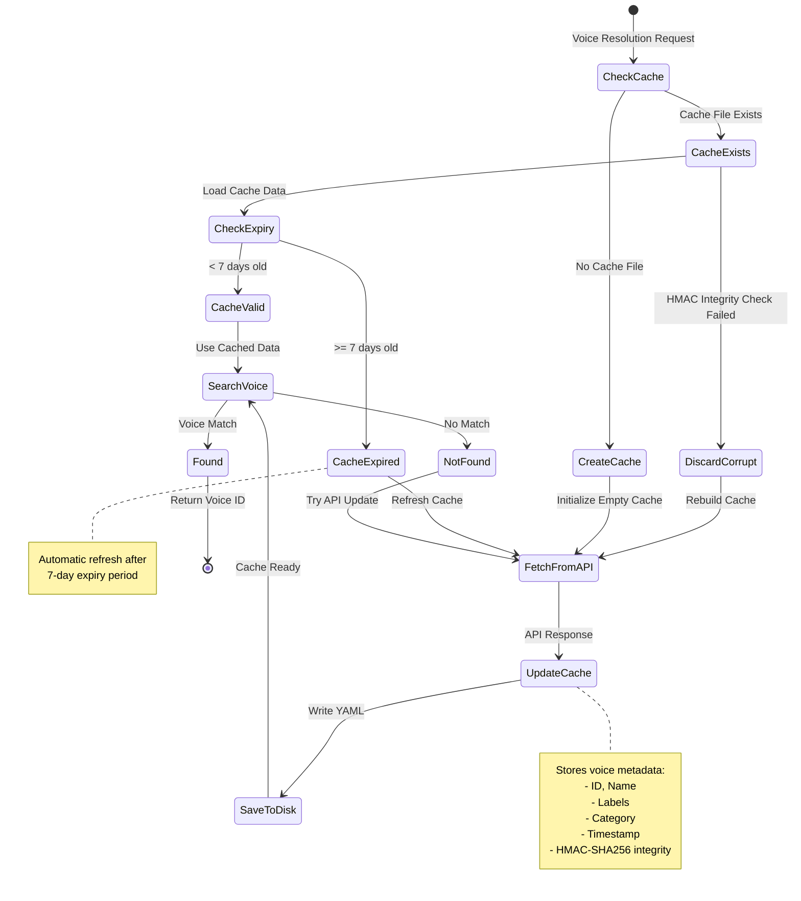

## Model Management System

The model management system provides automatic downloading and storage of offline TTS models (like Kokoro ONNX) using XDG-compliant directories.

### Model Downloader Architecture

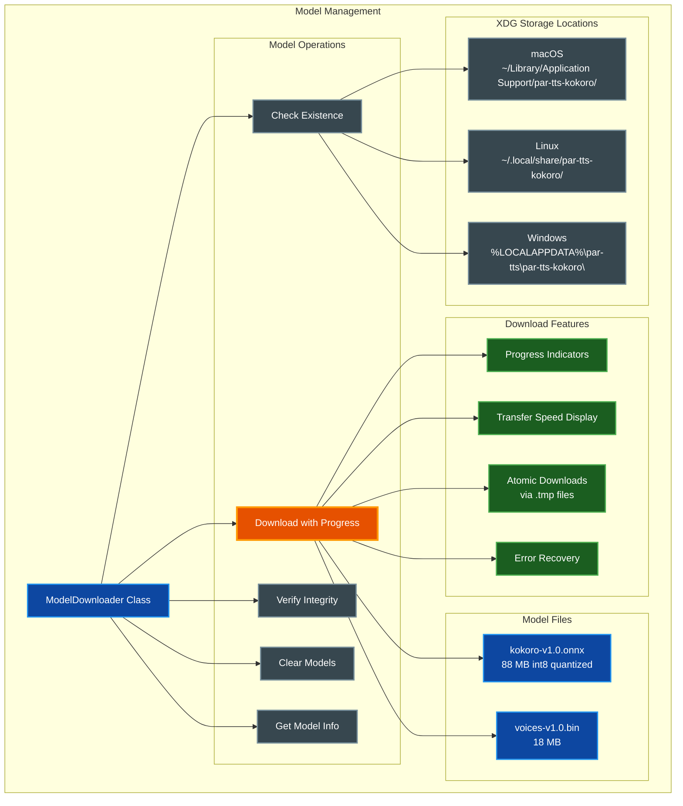

### Model Download Flow

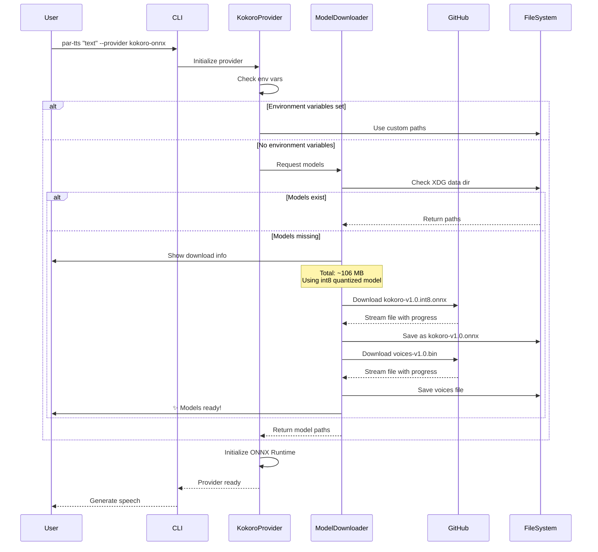

### Model CLI Management

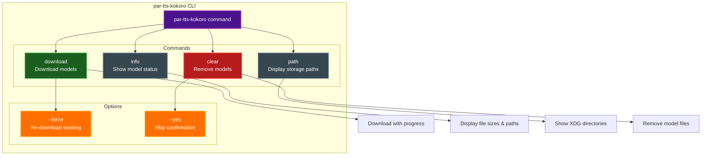

## Configuration Management

### Configuration Hierarchy

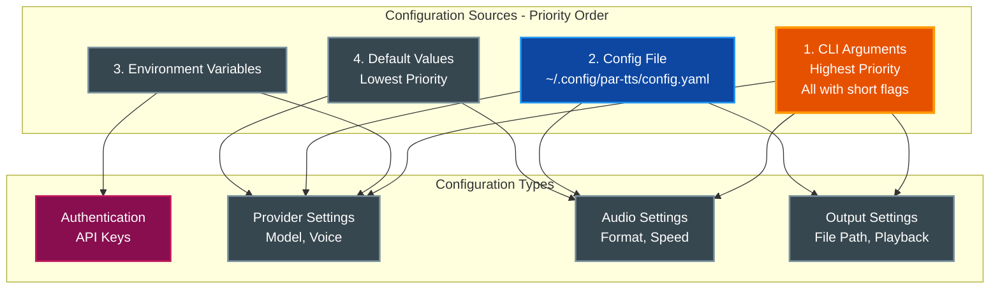

### Environment Variables

| Variable | Description | Default | Required |
|----------|-------------|---------|----------|
| `ELEVENLABS_API_KEY` | ElevenLabs API authentication | - | Yes* |
| `OPENAI_API_KEY` | OpenAI API authentication | - | Yes* |
| `DEEPGRAM_API_KEY` | Deepgram API authentication (`DG_API_KEY` also accepted) | - | Yes* |
| `GEMINI_API_KEY` | Gemini API authentication (`GOOGLE_API_KEY` also accepted) | - | Yes* |
| `KOKORO_MODEL_PATH` | Path to Kokoro ONNX model file | Auto-download | No |
| `KOKORO_VOICE_PATH` | Path to Kokoro voice embeddings | Auto-download | No |
| `TTS_PROVIDER` | Default TTS provider | `kokoro-onnx` | No |
| `TTS_VOICE_ID` | Default voice (overrides provider-specific) | - | No |
| `ELEVENLABS_VOICE_ID` | Default ElevenLabs voice | `Juniper` | No |
| `OPENAI_VOICE_ID` | Default OpenAI voice | `nova` | No |
| `KOKORO_VOICE_ID` | Default Kokoro ONNX voice | `af_sarah` | No |
| `DEEPGRAM_VOICE_ID` | Default Deepgram voice | `aura-2-thalia-en` | No |
| `GEMINI_VOICE_ID` | Default Gemini voice | `Kore` | No |

*At least one API key is required for cloud providers (Kokoro ONNX works offline without API keys)

## Build and Deployment Architecture

### Build Pipeline

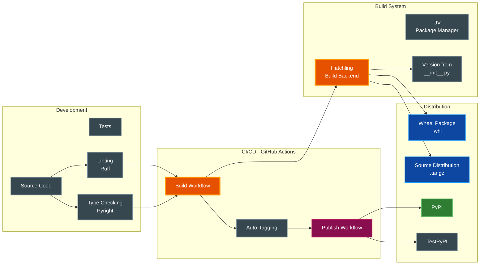

### GitHub Actions Workflows

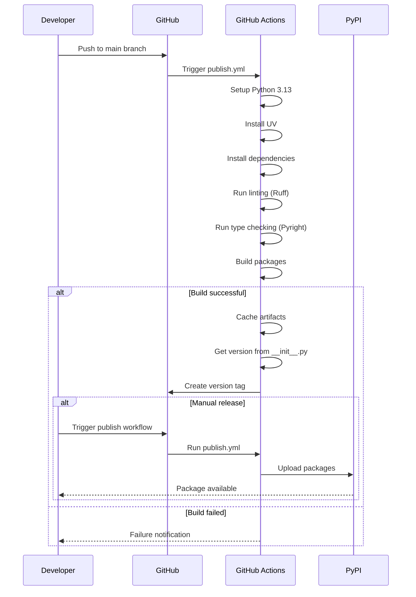

## Extension Points

### Adding a New Provider

The architecture is designed for easy extension with new TTS providers:

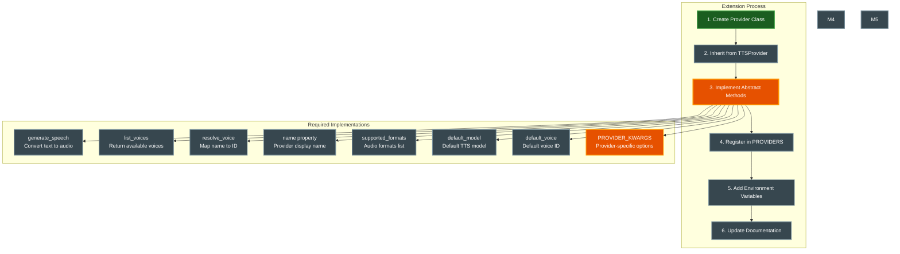

### Provider Template

```python
# par_tts/providers/new_provider.py
from typing import Any
from par_tts.providers.base import TTSProvider, Voice

class NewProvider(TTSProvider):
    """New TTS provider implementation."""

    # Declare provider-specific kwargs accepted by generate_speech().
    # Keys are kwarg names; values are defaults.  The CLI uses this
    # mapping to build provider-specific option dicts without if/elif chains.
    PROVIDER_KWARGS = {
        "speed": 1.0,
    }

    def __init__(self, api_key: str | None = None, **kwargs: Any):
        super().__init__(api_key, **kwargs)
        # Initialize provider-specific client

    @property
    def name(self) -> str:
        return "NewProvider"

    @property
    def supported_formats(self) -> list[str]:
        return ["mp3", "wav"]

    @property
    def default_model(self) -> str:
        return "default-model-id"

    @property
    def default_voice(self) -> str:
        return "default-voice-id"

    def generate_speech(self, text: str, voice: str,
                       model: str | None = None, **kwargs: Any) -> bytes | Iterator[bytes]:
        # Implementation
        pass

    def list_voices(self) -> list[Voice]:
        # Implementation
        pass

    def resolve_voice(self, voice_identifier: str) -> str:
        # Implementation
        pass

    # save_audio() and play_audio() are provided by the TTSProvider base class.
    # Override them only if the provider needs custom handling (e.g. ElevenLabs SDK save).
```

## Error Handling and Recovery

### Error Handling Strategy

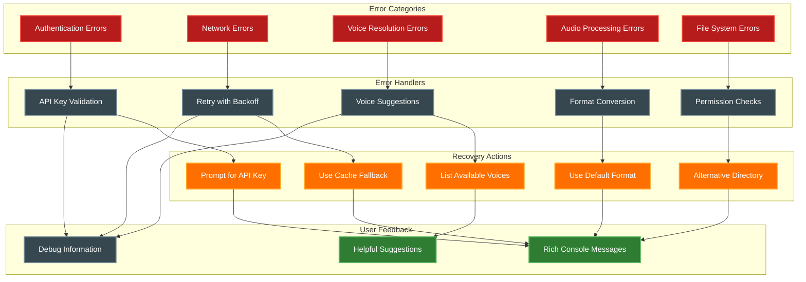

### Error Recovery Flow

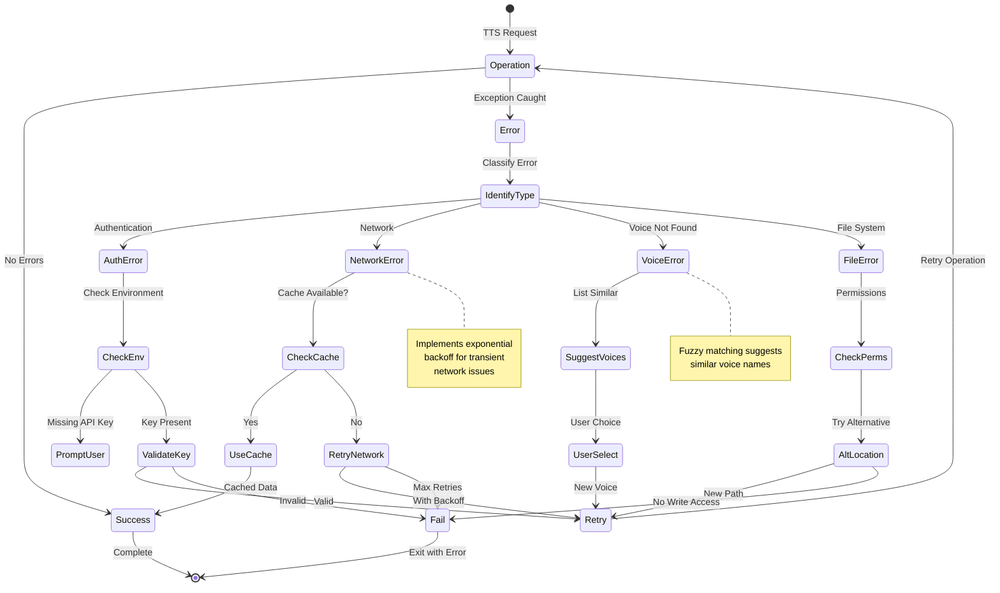

## Performance Considerations

### Performance Optimization Strategies

```mermaid
graph TB
    subgraph "Caching Strategies"
        VC[Voice Cache<br/>7-day TTL]
        LC[Library Cache<br/>elevenlabs module]
        FC[File Cache<br/>Recent audio files]
    end

    subgraph "Memory Optimization"
        STREAM["Iterator[bytes] Streaming"]
        DIRECT[Direct File Writing]
        CHUNK[Chunk Processing]
    end

    subgraph "API Optimization"
        BATCH[Batch Requests]
        APISTREAM[Streaming Responses]
        TIMEOUT[Request Timeouts<br/>10 seconds]
        RETRY[Smart Retry Logic]
    end

    subgraph "Resource Management"
        MEM[Memory Management<br/>Stream large files]
        TEMP[Temp File Cleanup]
        POOL[Connection Pooling]
    end

    subgraph "Parallel Processing"
        ASYNC[Async Operations<br/>Future Enhancement]
        MULTI[Multi-provider<br/>Parallel Requests]
    end

    VC --> PERF[Performance<br/>Improvements]
    LC --> PERF
    FC --> PERF

    BATCH --> PERF
    APISTREAM --> PERF
    TIMEOUT --> PERF
    RETRY --> PERF

    MEM --> PERF
    TEMP --> PERF
    POOL --> PERF

    ASYNC -.-> PERF
    MULTI -.-> PERF

    style VC fill:#0d47a1,stroke:#2196f3,stroke-width:2px,color:#ffffff
    style LC fill:#0d47a1,stroke:#2196f3,stroke-width:2px,color:#ffffff
    style FC fill:#0d47a1,stroke:#2196f3,stroke-width:2px,color:#ffffff
    style BATCH fill:#37474f,stroke:#78909c,stroke-width:2px,color:#ffffff
    style STREAM fill:#37474f,stroke:#78909c,stroke-width:2px,color:#ffffff
    style TIMEOUT fill:#37474f,stroke:#78909c,stroke-width:2px,color:#ffffff
    style RETRY fill:#37474f,stroke:#78909c,stroke-width:2px,color:#ffffff
    style MEM fill:#37474f,stroke:#78909c,stroke-width:2px,color:#ffffff
    style TEMP fill:#37474f,stroke:#78909c,stroke-width:2px,color:#ffffff
    style POOL fill:#37474f,stroke:#78909c,stroke-width:2px,color:#ffffff
    style ASYNC fill:#ff6f00,stroke:#ffa726,stroke-width:2px,stroke-dasharray: 5 5,color:#ffffff
    style MULTI fill:#ff6f00,stroke:#ffa726,stroke-width:2px,stroke-dasharray: 5 5,color:#ffffff
    style PERF fill:#2e7d32,stroke:#66bb6a,stroke-width:3px,color:#ffffff
```

### Performance Metrics

| Operation | Typical Duration | Optimization |
|-----------|-----------------|--------------|
| Voice Cache Hit | < 10ms | In-memory lookup |
| Voice Cache Miss | 500-1000ms | API call with caching |
| TTS Generation (100 chars) | 1-3s | Provider dependent |
| Audio Playback | Real-time | System audio buffer |
| File Write | < 100ms | Async I/O possible |
| Cache Expiry Check | < 1ms | Timestamp comparison |

### Bottleneck Analysis

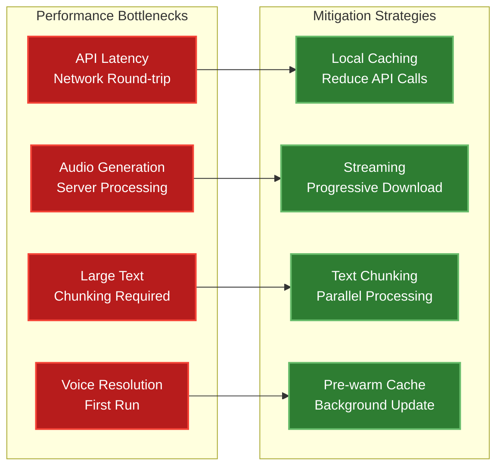

## Security Considerations

```mermaid
graph TB
    subgraph "Security Layers"
        subgraph "Authentication"
            KEYS[API Keys<br/>Environment Variables]
            VALID[Key Validation]
            ROTATE[Key Rotation Support]
            SANITIZE[Debug Output Sanitization]
        end

        subgraph "Data Protection"
            CACHE_SEC[Cache Security<br/>HMAC-SHA256 Integrity]
            TEMP_SEC[Temp File Security<br/>Secure Deletion]
            AUDIO_SEC[Audio Privacy<br/>No Cloud Storage]
            CHECKSUM[SHA256 Verification<br/>Model Integrity]
            CONF_SEC[Config File Permissions<br/>0600 Owner-Only]
        end

        subgraph "Input Validation"
            TEXT_VAL[Text Sanitization]
            PATH_VAL[Path Traversal Prevention]
            CMD_VAL[Command Injection Prevention]
        end

        subgraph "Network Security"
            HTTPS[HTTPS Only]
            TIMEOUT[Request Timeouts]
            CERT[Certificate Validation]
        end
    end

    KEYS --> VALID
    CACHE_SEC --> PERMS[File Permissions<br/>0600]
    CONF_SEC --> PERMS
    TEXT_VAL --> ESCAPE[Special Character Handling]
    HTTPS --> TLS[TLS 1.2+]

    style KEYS fill:#880e4f,stroke:#c2185b,stroke-width:2px,color:#ffffff
    style VALID fill:#37474f,stroke:#78909c,stroke-width:2px,color:#ffffff
    style ROTATE fill:#37474f,stroke:#78909c,stroke-width:2px,color:#ffffff
    style CACHE_SEC fill:#0d47a1,stroke:#2196f3,stroke-width:2px,color:#ffffff
    style TEMP_SEC fill:#0d47a1,stroke:#2196f3,stroke-width:2px,color:#ffffff
    style AUDIO_SEC fill:#0d47a1,stroke:#2196f3,stroke-width:2px,color:#ffffff
    style CHECKSUM fill:#0d47a1,stroke:#2196f3,stroke-width:2px,color:#ffffff
    style CONF_SEC fill:#0d47a1,stroke:#2196f3,stroke-width:2px,color:#ffffff
    style TEXT_VAL fill:#37474f,stroke:#78909c,stroke-width:2px,color:#ffffff
    style PATH_VAL fill:#37474f,stroke:#78909c,stroke-width:2px,color:#ffffff
    style CMD_VAL fill:#37474f,stroke:#78909c,stroke-width:2px,color:#ffffff
    style HTTPS fill:#1b5e20,stroke:#4caf50,stroke-width:2px,color:#ffffff
    style TIMEOUT fill:#37474f,stroke:#78909c,stroke-width:2px,color:#ffffff
    style CERT fill:#37474f,stroke:#78909c,stroke-width:2px,color:#ffffff
    style PERMS fill:#37474f,stroke:#78909c,stroke-width:2px,color:#ffffff
    style ESCAPE fill:#37474f,stroke:#78909c,stroke-width:2px,color:#ffffff
    style TLS fill:#1b5e20,stroke:#4caf50,stroke-width:2px,color:#ffffff
```

## Future Enhancements

### Roadmap

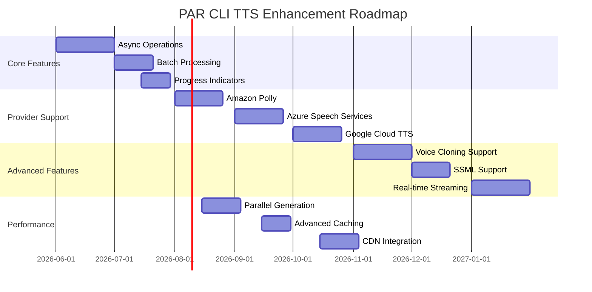

### Recent Improvements

#### v0.5.0

1. **Library API Surface**: `par_tts` is now a proper importable Python library with `get_provider()`, `list_providers()`, and typed options
2. **Import Package Renamed**: Canonical import is now `par_tts` (old `par_cli_tts` still works with deprecation warning)
3. **Decoupled from Rich**: Library modules use stdlib logging instead of Rich console
4. **Deepgram TTS Provider**: REST `/v1/speak` integration with full Aura/Aura-2 voice catalog
5. **Google Gemini TTS Provider**: `generateContent` audio modality with 30 prebuilt voices
6. **Per-Provider Voice Configuration**: New `voices:` mapping prevents voice bleed across providers
7. **Audio Playback Extracted**: Dedicated `par_tts.audio` module for library use

#### v0.4.2

1. **Config File Provider Setting**: Provider from config file now correctly overrides default
2. **API Keys in Config File**: API keys can now be stored in config file
3. **ElevenLabs Audio Playback**: Fixed volume control and iterator consumption

#### v0.4.0

1. **Full Windows Support**: Complete Windows compatibility with volume control
2. **OpenAI gpt-4o-mini-tts**: New default model with voice instructions support
3. **Extended Voice Selection**: OpenAI now supports 13 voices including ballad, verse, marin, cedar
4. **Voice Instructions**: OpenAI gpt-4o-mini-tts supports style instructions (e.g., "Speak in a cheerful tone")
5. **Kokoro Default Provider**: kokoro-onnx is now the default provider for offline-first usage

#### v0.2.0

1. **Configuration File Support**: YAML-based config at ~/.config/par-tts/config.yaml
2. **Consistent Error Handling**: ErrorType enum with categorized exit codes
3. **Smarter Voice Cache**: Change detection, manual refresh, sample caching
4. **Input Methods**: Support for stdin piping and file input (@filename)
5. **Volume Control**: Platform-specific volume adjustment (0.0-5.0)
6. **Voice Preview**: Test voices with sample text before use
7. **Memory Efficiency**: Stream audio directly to files without buffering
8. **Security**: API key sanitization in debug output
9. **Model Verification**: SHA256 checksums for downloaded models
10. **CLI Enhancement**: All options now have short flags

### Planned Architecture Improvements

1. **Cost Tracking**: Monitor and report API usage costs
2. **Better Progress Feedback**: Show progress for long text processing
3. **Plugin System**: Dynamic provider loading from external packages
4. **Voice Profile Management**: User-specific voice preferences and presets
5. **Advanced Caching**: Multi-tier caching with Redis support
6. **Monitoring and Metrics**: Performance tracking and usage analytics
7. **Web API**: RESTful API wrapper for the CLI functionality
8. **Voice Marketplace**: Integration with voice model marketplaces
9. **Multi-language Support**: Automatic language detection and switching
10. **Retry Logic**: Exponential backoff for network failures

## Conclusion

The PAR CLI TTS architecture provides a robust, extensible foundation for multi-provider text-to-speech operations. The provider abstraction pattern ensures easy integration of new services, while the caching system optimizes performance and reduces API costs. The modular design allows for independent evolution of components while maintaining system cohesion.

Key architectural achievements:
- **Provider Independence**: Core logic is decoupled from provider implementations
- **Performance Optimization**: Intelligent caching reduces latency and API calls
- **User Experience**: Rich CLI feedback with helpful error messages
- **Maintainability**: Type-safe, well-documented code with clear separation of concerns
- **Extensibility**: New providers can be added with minimal code changes

This architecture positions PAR CLI TTS for future growth while maintaining stability and performance for current users.

## Related Documentation

- [README.md](../README.md) - Project overview and installation guide
- [CHANGELOG.md](../CHANGELOG.md) - Version history and release notes
- [CLAUDE.md](../CLAUDE.md) - Development guide and code conventions
- [DOCUMENTATION_STYLE_GUIDE.md](DOCUMENTATION_STYLE_GUIDE.md) - Documentation standards for this project
- [pyproject.toml](../pyproject.toml) - Project configuration and dependencies
